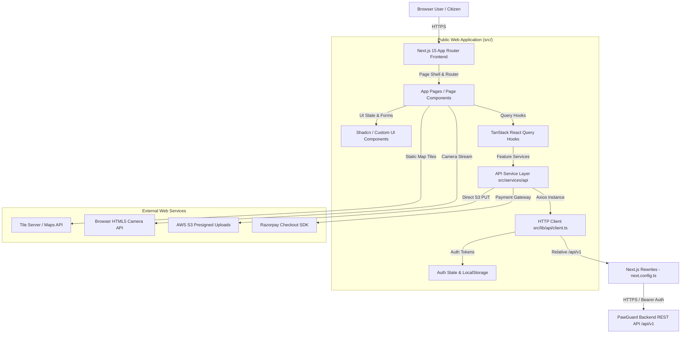
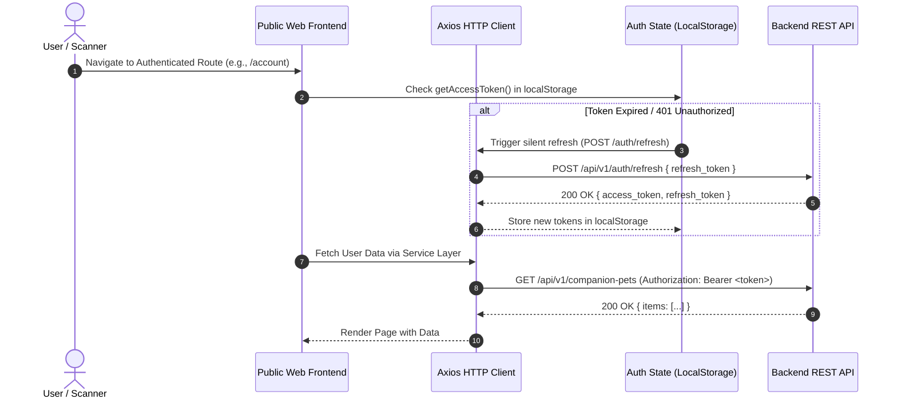

# Public Web System Architecture & API Integration

## Overview

The PawGuard Public Web application (`pawguard-nextjs`) is the primary desktop and mobile-responsive browser frontend for animal welfare operations, pet adoption, foster management, volunteer engagement, emergency rescue reporting, lost & found pet tracking, public QR safety tag scanning, veterinary appointment booking, smart pet reminders, donation processing, and grievance ticket tracking.

Built on **Next.js 15.5+ (App Router)** using **React 18.3+**, **TypeScript 5.9.3**, and **Tailwind CSS 4.1**, the application connects to the PawGuard REST API backend (`https://pawguard-backend-mqri.onrender.com/api/v1`) using a resilient HTTP client layer powered by Axios and TanStack React Query v5. The production frontend is deployed on **Vercel** at [`https://pawguard-web-v2.vercel.app`](https://pawguard-web-v2.vercel.app).

---

## Scope

This document covers the frontend software architecture, component organization, state management, authentication workflows, HTTP communication patterns, error resilience, and backend API integration patterns implemented in the Public Web application repository.

### Included Scope
- Next.js 15 App Router architecture & page hierarchy
- State management with TanStack Query v5 & Zustand v5
- Axios HTTP client configuration, token refresh interceptors, and exponential retry backoff
- JWT session management, local storage token persistence (`pawguard.access_token`, `pawguard.refresh_token`), and auth state synchronization
- Google OAuth 2.0 Token / Implicit Flow with CSRF State Validation (`/auth/callback`)
- Razorpay donation checkout (`POST /api/v1/donations/checkout`) and payment verification (`POST /api/v1/donations/verify`)
- Emergency urgent rescue alert banner integration (`GET /api/v1/portal/urgent-alerts`) with session-scoped dismissal (`sessionStorage`)
- Formal grievance ticket submission (`POST /api/v1/grievance`) and contact inquiry flows
- Public vs. Authenticated page route access controls
- API endpoint integration schemas for pets, adoptions, lost/found, rescue, volunteer, foster, appointments, reminders, and donations
- Client-side error handling, skeleton loading, and user feedback systems
- Security, privacy, and same-origin API proxy configurations (`next.config.ts`)

### Explicitly Excluded Scope
- Backend database implementations (PostgreSQL, SQL migrations, ORM schemas)
- Internal shelter administration tools (Admin Portal dashboards)
- Flutter and React Native mobile applications
- Mobile push notification engines (APNs / FCM)

---

## Features

- **Responsive Single-Page & SSR Navigation**: Seamless page transitions backed by Next.js 15 App Router and dynamic client components.
- **Unified Authentication System**: Dual-mode session handling supporting public browsing, email/password authentication, Google OAuth 2.0 Token Flow with state validation, and silent JWT token refresh.
- **Resilient API Request Layer**: Automatic retry handling for transient network issues, request timeout protection (15s standard / 60s upload), same-origin proxy rewrites, and standardized error normalization.
- **Real-Time Query Caching**: Client-side query invalidation and optimistic state updates via TanStack Query v5.
- **Privacy-Preserving Public Workflows**: Dedicated public endpoints for QR tag scanning, emergency rescue tracking, and public pet adoption browsing without requiring user login.
- **Live Emergency Urgent Alert Banner**: Synchronized active rescue alert banner with visitor session-scoped dismissal controls.
- **Dynamic Payment Checkout**: Integrated Razorpay checkout flow with dynamic backend key provisioning (`order.checkout_key`).

---

## Architecture Diagram



### Production Deployment Architecture
* **Frontend Hosting Platform:** Vercel (`https://pawguard-web-v2.vercel.app`)
* **Backend Hosting Platform:** Render (`https://pawguard-backend-mqri.onrender.com/api/v1`)
* **Client API Proxy:** Browser requests target relative `/api/v1/*` paths, which are rewritten server-side by Next.js (`next.config.ts`) to `https://pawguard-backend-mqri.onrender.com/api/v1/:path*`. This guarantees same-origin request context and avoids cross-site CORS issues.

---

## Frontend Architecture

### Core Tech Stack
- **Framework**: Next.js 15.5.23 (React 18.3.1)
- **Language**: TypeScript 5.9.3
- **Styling**: Tailwind CSS 4.1.12, Radix UI Primitives, Lucide Icons
- **State Management**: TanStack React Query v5.101.4, Zustand v5.0.14
- **HTTP Client**: Axios 1.19.0
- **QR Utilities**: `html5-qrcode` 2.3.8, `jsqr` 1.4.0, `qrcode` 1.5.4
- **Payment Gateway**: Razorpay Web Checkout SDK (`checkout.js`)

### Directory Structure
```
src/
├── app/                  # Next.js App Router route handlers & pages
│   ├── (public pages)   # /, /about, /adopt, /lost-found, /emergency, /scan
│   ├── account/         # User profile, pet management, notification preferences
│   ├── appointments/    # Vet appointment booking & history
│   ├── auth/            # OAuth authentication callback handler (/auth/callback)
│   ├── contact/         # Contact form & grievance ticket submission
│   ├── donate/          # Razorpay donation portal & receipt download
│   ├── foster/          # Foster placement tracking & supply requests
│   ├── reminders/       # Smart pet vaccination & care reminders
│   └── volunteer/       # Volunteer application & dashboard
├── components/          # Reusable UI elements, modals, maps, scanners, UrgentAlertBanner
├── lib/
│   └── api/             # HTTP client, interceptors, error parsers, constants, session
├── services/
│   └── api/             # Modular API service modules (pets, lost-found, vet, donation, grievance)
└── types/               # TypeScript domain models and DTO interfaces
```

---

## User Flow & Authentication



---

## Frontend Implementation

### Page & Component Organization
1. **Page Shell (`PageShell.tsx`)**: Wraps every view with header navigation, emergency announcement banner (`UrgentAlertBanner.tsx`), footer, and responsive containers.
2. **Feature Pages (`src/app/pages/`)**: Contains page-level business logic, search parameters, layout state, and query calls.
3. **Services (`src/services/api/`)**: Single-responsibility modules mapping frontend actions directly to API endpoints (`auth.ts`, `tag.ts`, `lost-found.ts`, `vet.ts`, `emergency.ts`, `donation.ts`, `grievance.ts`).

---

## API Integration

### Centralized Route Constants (`src/lib/api/constants.ts`)
All API endpoints are defined in a central route map relative to the `/api/v1` base URL:

```typescript
export const API_ROUTES = {
  health: "/health",
  auth: {
    login: "/auth/login",
    register: "/auth/register",
    refresh: "/auth/refresh",
    me: "/auth/me",
    oauthLogin: "/auth/oauth/login",
  },
  companionPets: {
    base: "/companion-pets",
    pet: (id: string) => `/companion-pets/${id}`,
    appointments: "/companion-pets/appointments",
    clinics: "/companion-pets/clinics",
    reminders: (petId: string) => `/companion-pets/${petId}/reminders`,
  },
  lostFound: {
    lost: "/lost-found/lost",
    found: "/lost-found/found",
    sighting: "/lost-found/sighting",
    broadcast: (reportId: string) => `/lost-found/lost/${reportId}/broadcast`,
  },
  safetyTag: {
    scan: "/companion-pets/safety-tag/scan",
    petTag: (petId: string) => `/companion-pets/${petId}/safety-tag`,
  },
  donations: {
    checkout: "/donations/checkout",
    verify: "/donations/verify",
    history: "/donations/history",
    receipt: (id: string) => `/donations/${id}/receipt`,
  },
  portal: {
    urgentAlerts: "/portal/urgent-alerts",
    grievance: "/grievance",
  },
};
```

---

## Subsystem Integrations

### 1. Google OAuth 2.0 Integration
* **Flow Name:** Google OAuth 2.0 Token / Implicit Flow with CSRF State Validation
* **Callback Handler:** `/auth/callback` (`src/app/auth/callback/page.tsx`)
* **State Verification:** Generates random state parameter stored in `sessionStorage.setItem("oauth_state", state)` and validates returned state on `/auth/callback`.
* **Token Exchange:** On callback validation, extracts provider token payload and submits to `POST /api/v1/auth/oauth/login`. The backend issues standard PawGuard access and refresh tokens.

### 2. Razorpay Donation Integration
* **Checkout Order Creation:** Public Web calls `POST /api/v1/donations/checkout`.
* **Dynamic Checkout Key:** The backend returns checkout metadata including `order.checkout_key`. The frontend dynamically uses `order.checkout_key` to initialize Razorpay Checkout.js (no `NEXT_PUBLIC_RAZORPAY_KEY_ID` frontend environment variable is required).
* **Payment Verification:** Upon checkout completion, Public Web submits verification payload to `POST /api/v1/donations/verify` containing `gateway_payment_id`, `gateway_signature`, and `gateway_order_id`.

### 3. Emergency & Urgent Rescue Alert Banner
* **Alert Feed:** Public Web fetches active urgent alerts via `GET /api/v1/portal/urgent-alerts`.
* **Banner Presentation:** High-severity alerts display prominently in `UrgentAlertBanner.tsx`.
* **Client-Side Session Dismissal:** Visitors can dismiss individual alerts via the close (`×`) button. Dismissed alert IDs are stored in `sessionStorage`. Dismissal is visitor-session scoped and does not delete or deactivate the backend alert record.

### 4. Contact & Grievance Ticketing Integration
* **Inquiry Submission:** Public contact form and formal grievance submissions post to `POST /api/v1/grievance`.
* **Ticket Tracking:** Authenticated users view submitted inquiry history and grievance status updates in their dashboard account portal.

---

## Authentication & Authorization

### Session Persistence & Token Handling
- **Access Token Key**: `pawguard.access_token` (stored in `window.localStorage`)
- **Refresh Token Key**: `pawguard.refresh_token` (stored in `window.localStorage`)
- **Axios Interceptor**: Automatically attaches `Authorization: Bearer <token>` to outbound requests when a session is active.
- **CSRF Protection**: Attaches `X-CSRF-Token` header for mutating HTTP requests when `pg_csrf_token` cookie is present.
- **Silent Token Refresh**: When a request receives a `401 Unauthorized` status, the Axios interceptor attempts a single token refresh call (`POST /auth/refresh` sending `refresh_token`). If successful, the new access token is stored in `localStorage` and the original request is retried seamlessly.

---

## Error Handling

### Normalized API Errors (`src/lib/api/errors.ts`)
API errors are parsed into a standardized `ApiError` format:
- `statusCode`: HTTP response status (400, 401, 403, 404, 422, 500)
- `code`: Domain error string (e.g., `NOT_FOUND`, `UNAUTHORIZED`, `VALIDATION_ERROR`)
- `message`: User-friendly diagnostic message
- `details`: Validation errors field map (if 422)

### UI Feedback
- **Skeletons**: Displayed during initial query loading state.
- **Alert Components**: Displayed on fetch failure with interactive **Retry** triggers.
- **Sonner Toast Alerts**: Used for transient mutation feedback (e.g., "Appointment booked successfully").

---

## Security / Privacy

- **XSS Mitigation**: React JSX automatic HTML escaping.
- **Privacy-Safe Scanning**: Public QR tag scans expose only essential pet rescue details (name, photo, medical alerts, emergency contact button); private owner details (home address, personal email) are hidden.
- **OAuth CSRF Defense**: `sessionStorage` state token verification prevents OAuth login CSRF attacks.
- **S3 Presigned Uploads**: Direct browser-to-S3 uploads avoid routing large image binaries through application servers.

---

## Backend Data Entities

*Backend data entities consumed through API integration:*
- `User`: Authenticated owner / citizen profile
- `CompanionPet`: Owner-registered pet record
- `SafetyTag`: QR token association
- `LostPetReport` / `FoundPetReport`: Lost and found pet listings
- `VetClinic` / `PetAppointment`: Veterinary network records
- `PetReminder`: Care and vaccination reminder record
- `DonationOrder` / `DonationReceipt`: Payment and tax receipt records
- `GrievanceTicket`: Formal citizen inquiry and complaint record

---

## Related Modules

- [02-qr-safety-tag](../02-qr-safety-tag/README.md)
- [03-repository-and-qa](../03-repository-and-qa/README.md)
- [04-lost-found-alert-system](../04-lost-found-alert-system/README.md)
- [05-vet-directory-and-appointments](../05-vet-directory-and-appointments/README.md)
- [06-pet-reminders](../06-pet-reminders/README.md)
