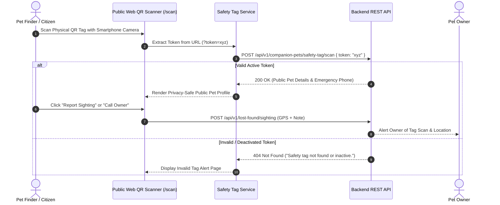

# Public Web QR Safety Tag Workflow

## Overview

The PawGuard QR Safety Tag system provides a digital safety net for companion pets. Each registered pet can be provisioned with a unique, encrypted QR safety tag. When a physical tag attached to a pet's collar is scanned by a finder using any smartphone camera or the built-in PawGuard browser scanner, the Public Web application resolves the token and renders a privacy-safe public pet profile with direct contact and sighting submission capabilities.

---

## Scope

This document details the frontend implementation, camera scanning workflow, QR code generation, privacy safeguards, token resolution, and safety tag lifecycle management in the Public Web application.

### Included Scope
- Browser camera QR scanner component (`src/app/components/scan/QrScanner.tsx`) backed by `html5-qrcode` and `jsqr`
- Public scan resolution page (`src/app/pages/PublicScanPage.tsx` at route `/scan?token=...`)
- Owner safety-tag management interface (provisioning, viewing, rotating, deactivating tags)
- Client-side QR code image rendering (`qrcode` library)
- Privacy-safe pet profile rendering for public scanners
- Sighting report submission from public scan page

### Explicitly Excluded Scope
- Physical tag manufacturing / printing backend logistics
- Mobile native camera plugins (Flutter / React Native hardware handlers)
- Private owner location tracking without explicit user consent

---

## Features

- **Universal Public Scanning**: Any citizen can scan a tag without installing an app or logging in.
- **Privacy Shielding**: Displays pet medical needs, behavioral notes, and emergency contact buttons while masking private home addresses and personal emails.
- **Instant Sighting Submission**: Finders can submit their current GPS coordinates and a photo directly from the scan result page.
- **Owner Tag Management**: Pet owners can provision new tags, preview QR codes, download high-resolution PNG tags, or deactivate lost tags.

---

## Workflow Diagram

---

## User Flow

### 1. Public Scanning Flow
1. Finder scans QR tag or opens `/scan?token=<token>`.
2. Browser camera opens in `QrScanner` using `html5-qrcode`.
3. Token is validated via `POST /companion-pets/safety-tag/scan`.
4. Public scan view displays pet photo, name, species, medical alerts, microchip ID (if public), and an interactive **Contact Owner** button.
5. Finder can optionally submit a GPS sighting report.

### 2. Owner Management Flow
1. Logged-in pet owner navigates to `/account` or `/account/pets/[id]`.
2. Owner clicks **Manage Safety Tag**.
3. Frontend requests tag status via `GET /companion-pets/{pet_id}/safety-tag`.
4. If no tag exists, owner clicks **Provision Safety Tag** (`POST /companion-pets/{pet_id}/safety-tag`).
5. Frontend renders downloadable QR code pointing to canonical origin (`PUBLIC_SITE_URL/scan?token=<token>`).
6. Owner can deactivate a tag at any time (`DELETE /companion-pets/{pet_id}/safety-tag`).

---

## Frontend Implementation

### Primary Components & Pages
- **`src/app/components/scan/QrScanner.tsx`**: High-performance browser QR scanner with double `requestAnimationFrame` initialization and stream cleanup on unmount.
- **`src/app/pages/PublicScanPage.tsx`**: Dynamic scan result view handling public pet profiles, dog rescue profiles (`/dogs/{id}/public-scan`), and sighting forms.
- **`src/app/scan/page.tsx`**: Route entrypoint for scanning and token query parameters.
- **`src/services/api/safety-tag/index.ts`**: API integration service layer.

---

## API Integration

### Consumed Endpoints

| Method | Endpoint | Auth Required | Purpose |
|--------|----------|---------------|---------|
| `POST` | `/api/v1/companion-pets/safety-tag/scan` | No (Public) | Resolve QR token to public pet details |
| `GET` | `/api/v1/companion-pets/{pet_id}/safety-tag` | Yes (Owner) | Fetch pet's current safety tag metadata |
| `POST` | `/api/v1/companion-pets/{pet_id}/safety-tag` | Yes (Owner) | Provision or rotate safety tag |
| `DELETE` | `/api/v1/companion-pets/{pet_id}/safety-tag` | Yes (Owner) | Deactivate safety tag |
| `GET` | `/api/v1/dogs/{dog_id}/public-scan` | No (Public) | Resolve rescue dog QR scan profile |

---

## Security / Privacy

- **Token Scrambling**: Raw database IDs are never encoded in QR tags; cryptographically secure UUID tokens are used.
- **Owner Contact Relay**: Emergency contact phone numbers are exposed via action buttons without revealing full physical street addresses.
- **HTTPS Enforcement**: Camera access requires an active HTTPS context in modern browsers.

---

## Related Modules

- [01-system-architecture-and-api](../01-system-architecture-and-api/README.md)
- [04-lost-found-alert-system](../04-lost-found-alert-system/README.md)
