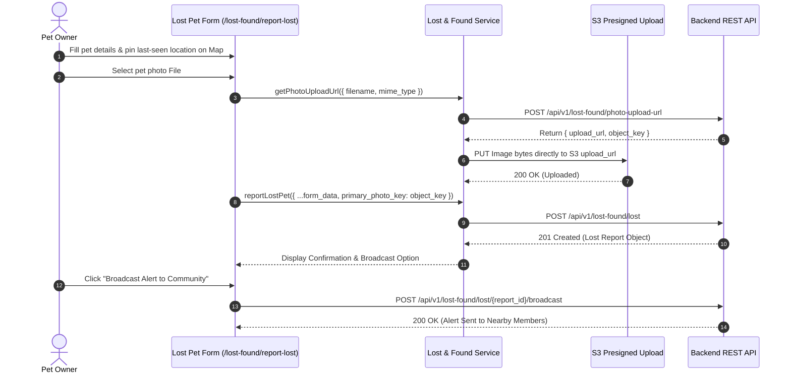
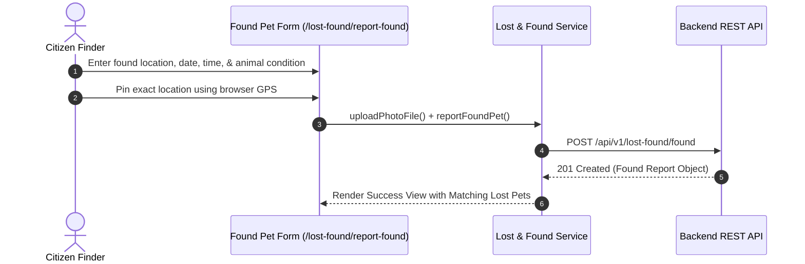
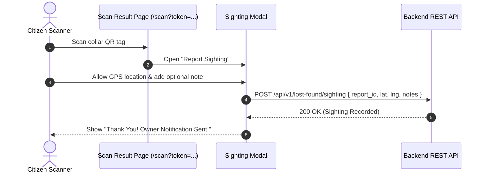

# Lost & Found Alert System

## Overview

The PawGuard Lost & Found Alert System is a core Public Web module designed to rapidly reconnect lost pets with their owners. It allows pet owners to file lost pet reports, citizen rescuers to report found roaming animals, community members to submit sightings with GPS coordinates, and owners to issue neighborhood broadcast alerts.

---

## Scope

This document details the frontend implementation, interactive map integration, presigned S3 photo upload pipeline, sighting submission modal, broadcast alert engine, and match claim workflow in the Public Web application.

### Included Scope
- Lost pet reporting page (`/lost-found/report-lost`)
- Found pet reporting page (`/lost-found/report-found`)
- Unified Lost & Found pet directory & map view (`/lost-found`)
- Interactive location picker (`LocationMapPicker.tsx`) with coordinate selection & browser GPS geolocation
- QR safety tag sighting modal (`FoundPetSightingModal.tsx`)
- S3 presigned photo upload flow (`POST /lost-found/photo-upload-url` + S3 PUT upload)
- Community broadcast alert trigger (`POST /lost-found/lost/{id}/broadcast`)
- Ownership match claim flow (`POST /lost-found/matches/{match_id}/claim`)

### Explicitly Excluded Scope
- Admin geofencing boundary management
- Shelter physical cage assignment internal tools

---

## Features

- **Interactive Map Search**: Visualizes reported lost and found pet pins across a dynamic map tile interface.
- **GPS Location Pinning**: Allows users to pin exact last-seen or found coordinates with search-by-address support.
- **Presigned Image Uploads**: Direct-to-S3 photo uploads for high-resolution pet verification photos.
- **Instant Neighborhood Broadcast**: Triggers automated alert notifications to registered community volunteers within proximity.
- **Public Sighting Submissions**: Enables any citizen or QR scanner to submit sighting location data without signing up.

---

## Architecture Diagram

```mermaid
graph TD
    User[Public Citizen / Pet Owner] -->|Browse / Pin / Report| UI[Lost & Found UI Component]
    
    subgraph "Public Web Frontend"
        UI -->|Location Pinning| MapPicker[LocationMapPicker.tsx]
        UI -->|Sighting Modal| SightingModal[FoundPetSightingModal.tsx]
        UI -->|Form Submission| LFService[lostFoundService (src/services/api/lost-found)]
    end

    subgraph "Storage & Media Pipeline"
        LFService -->|1. Request Presigned URL| API[PawGuard Backend REST API]
        API -->|Return upload_url & object_key| LFService
        LFService -->|2. Direct HTTP PUT| S3Bucket[Amazon S3 Storage]
    end

    subgraph "Backend API Processing"
        LFService -->|3. Submit Report JSON| API
        API -->|Trigger Alert| BroadcastEngine[Neighborhood Alert Engine]
        API -->|Match Algorithms| MatchEngine[AI Pattern Matching Engine]
    end
```

---

## Workflows & User Flows

### 1. Lost Pet Reporting Flow



### 2. Found Pet Reporting Flow



### 3. QR Sighting Flow



---

## Frontend Implementation

### Key Source Files
- **`src/app/pages/LostFoundPage.tsx`**: Main directory view with filter tabs (All, Lost, Found), grid layout, and search inputs.
- **`src/app/pages/LostPetReportPage.tsx`**: Multi-step lost pet submission form.
- **`src/app/pages/FoundPetReportPage.tsx`**: Multi-step found pet submission form.
- **`src/app/components/map/LocationMapPicker.tsx`**: Interactive Leaflet/OpenStreetMap container providing click-to-pin, address search, and GPS detection.
- **`src/app/components/map/FoundPetSightingModal.tsx`**: Popover modal for reporting pet sightings.
- **`src/services/api/lost-found/index.ts`**: Service encapsulating all API endpoints.

---

## API Integration

### Consumed Endpoints

| Method | Endpoint | Auth Required | Purpose |
|--------|----------|---------------|---------|
| `GET` | `/api/v1/lost-found/lost` | No (Public) | Fetch paginated lost pet reports |
| `GET` | `/api/v1/lost-found/found` | No (Public) | Fetch paginated found pet reports |
| `GET` | `/api/v1/lost-found/lost/{id}` | No (Public) | Fetch single lost pet report details |
| `GET` | `/api/v1/lost-found/found/{id}` | No (Public) | Fetch single found pet report details |
| `POST` | `/api/v1/lost-found/photo-upload-url` | Yes | Request presigned S3 photo upload URL |
| `POST` | `/api/v1/lost-found/lost` | Yes | Submit a new lost pet report |
| `POST` | `/api/v1/lost-found/found` | Yes | Submit a new found pet report |
| `POST` | `/api/v1/lost-found/lost/{id}/broadcast` | Yes | Broadcast neighborhood alert |
| `POST` | `/api/v1/lost-found/sighting` | No (Public) | Submit a pet sighting with GPS |
| `GET` | `/api/v1/lost-found/lost/{id}/matches` | Yes | Fetch AI-suggested potential matches |
| `POST` | `/api/v1/lost-found/matches/{id}/claim` | Yes | Submit ownership proof document |

---

## Security / Privacy

- **Presigned Upload Scoping**: Image presigned URLs expire rapidly (typically 15 minutes) and are restricted to image MIME types.
- **Anonymous Sightings**: Citizens reporting sightings do not need an account, encouraging quick reports while shielding their personal data.

---

## Related Modules

- [01-system-architecture-and-api](../01-system-architecture-and-api/README.md)
- [02-qr-safety-tag](../02-qr-safety-tag/README.md)
