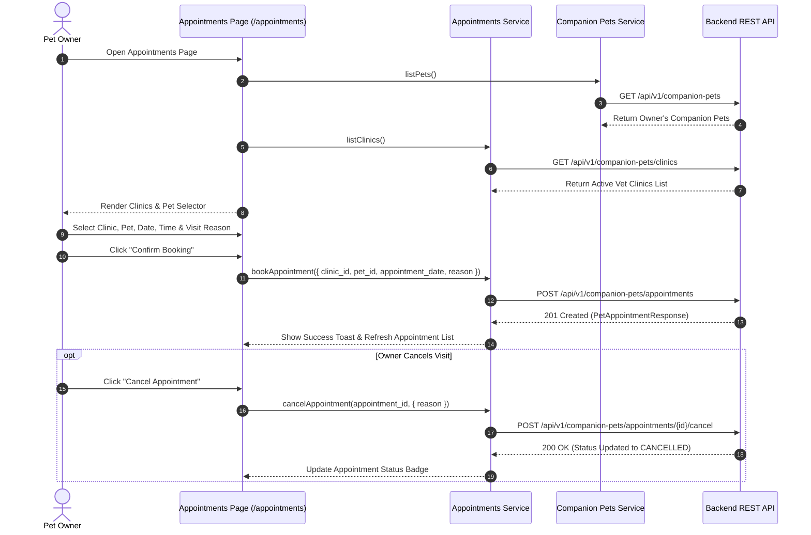

# Vet Directory & Appointment Booking

## Overview

The Vet Directory & Appointment Booking module connects pet owners with PawGuard's partner veterinary clinics. Pet owners can discover verified clinics, search by location or service specialty, view operating schedules, select a registered companion pet, and book veterinary appointments online directly from the Public Web interface.

---

## Scope

This document details the veterinary directory search, clinic details view, appointment booking modal, pet selection workflow, owner appointment history management, and appointment cancellation process in the Public Web application.

### Included Scope
- Veterinary network directory browsing (`/veterinary-network` & `/appointments`)
- Active partner clinic search & filtering (`GET /companion-pets/clinics`)
- Pet owner appointment booking modal (`POST /companion-pets/appointments`)
- Authenticated owner pet selector (fetching caller's pets via `GET /companion-pets`)
- Owner appointment list & status tracking (`GET /companion-pets/appointments`)
- Appointment cancellation workflow (`POST /companion-pets/appointments/{id}/cancel`)

### Explicitly Excluded Scope
- Clinic staff administrative schedule configuration
- Clinic confirmation/rejection internal portal actions (`POST .../confirm`)
- Direct electronic health record (EHR) database mutations

---

## Features

- **Clinic Discovery**: Browse verified veterinary clinics with address details, contact numbers, operating hours, and emergency availability indicators.
- **Seamless Online Booking**: Select an owner pet, choose an appointment date and time slot, specify reason for visit (vaccination, routine checkup, illness), and submit instantly.
- **Pet Scoping**: Automatically populates the pet dropdown from the authenticated user's registered companion pets.
- **Appointment History & Status**: View pending, confirmed, completed, or cancelled appointments with interactive cancellation triggers for upcoming visits.

---

## Appointment Booking Workflow

---

## User Flow

1. **Browse Clinics**: User visits `/veterinary-network` or opens the appointment modal on `/appointments`.
2. **Select Pet**: Logged-in user selects one of their registered companion pets from the dropdown.
3. **Select Date & Time**: User picks an available slot and specifies visit details (e.g., "Annual Rabies Vaccination").
4. **Submit Booking**: Frontend sends booking request to `POST /companion-pets/appointments`.
5. **Track Visit**: Appointment appears in the user's dashboard under **Upcoming Appointments** with real-time status badges (`PENDING`, `CONFIRMED`, `CANCELLED`, `COMPLETED`).
6. **Cancel Appointment**: Owner can click **Cancel** on any upcoming appointment prior to the visit time.

---

## Frontend Implementation

### Primary Files
- **`src/app/pages/AppointmentsPage.tsx`**: Main appointment manager displaying active bookings, past history, and booking triggers.
- **`src/app/pages/VeterinaryNetworkPage.tsx`**: Public partner clinic directory view.
- **`src/services/api/appointments/index.ts`**: API service encapsulating clinic listing, booking, and cancellation calls.
- **`src/services/api/pets/index.ts`**: Service fetching owner companion pets.

---

## API Integration

### Consumed Endpoints

| Method | Endpoint | Auth Required | Purpose |
|--------|----------|---------------|---------|
| `GET` | `/api/v1/companion-pets/clinics` | No (Public) | Fetch active partner vet clinics |
| `GET` | `/api/v1/companion-pets/clinics/{id}` | No (Public) | Fetch clinic details |
| `GET` | `/api/v1/companion-pets/appointments` | Yes (Owner) | Fetch user's appointments |
| `GET` | `/api/v1/companion-pets/appointments/{id}` | Yes (Owner) | Fetch single appointment details |
| `POST` | `/api/v1/companion-pets/appointments` | Yes (Owner) | Book a new vet appointment |
| `POST` | `/api/v1/companion-pets/appointments/{id}/cancel` | Yes (Owner) | Cancel an existing appointment |

---

## Security / Privacy

- **User Ownership Scoping**: The backend strictly enforces that users can only view and cancel appointments for pets tied to their account ID.
- **Role-Based Action Segregation**: Appointment confirmation (`POST .../confirm`) requires clinic staff permissions and is excluded from the Public Web UI.

---

## Related Modules

- [01-system-architecture-and-api](../01-system-architecture-and-api/README.md)
- [06-pet-reminders](../06-pet-reminders/README.md)
