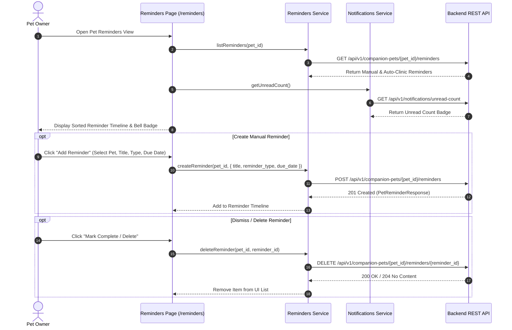

# Smart Pet Reminders

## Overview

The Smart Pet Reminders module helps pet owners manage recurring health and care schedules for their companion pets. Owners can set custom reminders for vaccinations, medications, grooming, flea/tick treatments, and routine vet checkups. Additionally, auto-generated clinic reminders created when a partner veterinary clinic updates a medical record (`source_key: "medical_record:..."`) automatically synchronize into the owner's Public Web dashboard.

---

## Scope

This document details manual reminder creation, auto-generated clinic reminder handling, due-date calculation, soft-deletion, and in-app notification list synchronization in the Public Web application.

### Included Scope
- Pet reminder creation modal (`POST /companion-pets/{pet_id}/reminders`)
- Companion pet reminder listing (`GET /companion-pets/{pet_id}/reminders`)
- Reminder soft-deletion (`DELETE /companion-pets/{pet_id}/reminders/{reminder_id}`)
- Reminder categories (Vaccination, Medication, Grooming, Vet Checkup, General Care)
- Auto-generated clinic medical record reminder integration
- In-app notification center synchronization (`GET /notifications`, unread count badge)

### Explicitly Excluded Scope
- Native mobile push notification engine (APNs / FCM push triggers belong exclusively to the mobile native application)
- SMS / Telephony gateway hardware dispatching

---

## Features

- **Custom Reminder Creation**: Owners can set due dates, titles, reminder categories, and notes for any registered pet.
- **Auto-Sync Clinic Reminders**: Reminders set by veterinary clinics during checkups automatically populate in the pet owner's reminder dashboard alongside manual entries.
- **Status Classification**: Automatically categorizes reminders as **Upcoming**, **Due Today**, or **Overdue** based on current date evaluation.
- **In-App Notification Center Sync**: Syncs active reminders with the top header bell notification dropdown and unread counter badge.
- **One-Click Dismissal / Soft-Delete**: Allows owners to mark reminders as completed or dismiss them from their schedule.

---

## Workflow Diagram

---

## User Flow

1. **View Reminders**: Owner navigates to `/reminders` or opens the **Reminders** tab on a pet's profile page (`/account/pets/[id]`).
2. **Add Reminder**: Click **Add Reminder**, choose the pet, select reminder type (e.g., `VACCINATION`), set due date, and enter notes (e.g., "Booster shot due").
3. **Automatic Synchronization**: Clinic medical record reminders (e.g., `source_key: "medical_record:rec_123"`) appear automatically with a clinic badge.
4. **Header Notification Badge**: When a reminder becomes due, the global navbar bell icon displays an unread indicator.
5. **Dismiss / Complete**: Owner clicks **Mark as Done** to soft-delete the reminder from the active list.

---

## Frontend Implementation

### Key Source Files
- **`src/app/pages/RemindersPage.tsx`**: Main care schedule dashboard.
- **`src/app/pages/PetDetailPage.tsx`**: Individual pet profile page containing the per-pet reminder tab.
- **`src/app/pages/NotificationsPage.tsx`**: In-app notification center.
- **`src/services/api/reminders/index.ts`**: API service for listing, creating, and deleting reminders.
- **`src/services/api/notifications/index.ts`**: Service for in-app notification center and unread count badges.

---

## API Integration

### Consumed Endpoints

| Method | Endpoint | Auth Required | Purpose |
|--------|----------|---------------|---------|
| `GET` | `/api/v1/companion-pets/{pet_id}/reminders` | Yes (Owner) | Fetch all reminders for a specific pet |
| `POST` | `/api/v1/companion-pets/{pet_id}/reminders` | Yes (Owner) | Create a manual pet care reminder |
| `DELETE` | `/api/v1/companion-pets/{pet_id}/reminders/{id}` | Yes (Owner) | Soft-delete / dismiss a reminder |
| `GET` | `/api/v1/notifications` | Yes (Owner) | List in-app notifications |
| `GET` | `/api/v1/notifications/unread-count` | Yes (Owner) | Fetch header bell badge unread count |
| `POST` | `/api/v1/notifications/{id}/read` | Yes (Owner) | Mark in-app notification as read |

---

## Security / Privacy

- **Pet Scoping**: Reminder operations require owner authentication and verify that the specified `pet_id` belongs to the requesting user account.
- **Idempotent Posting**: Manual reminders enforce `source_key` checks to prevent accidental duplicate reminder postings.

---

## Related Modules

- [01-system-architecture-and-api](../01-system-architecture-and-api/README.md)
- [05-vet-directory-and-appointments](../05-vet-directory-and-appointments/README.md)
