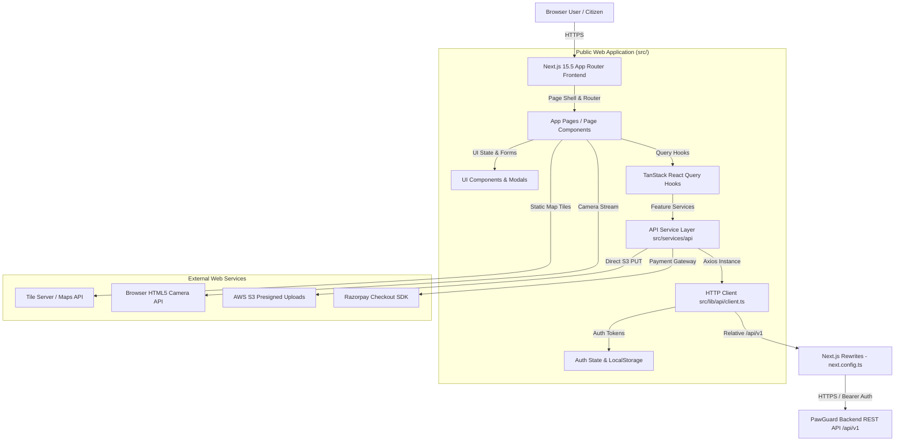

# Module 01 — System Architecture & API Integration

Status: **IMPLEMENTED / PRODUCTION-READY**

## System Architecture Overview

PawGuard Public Web (`pawguard-nextjs`) is engineered as a modern, decoupled web frontend leveraging **Next.js 15.5+ (App Router)**, **React 18.3+**, **TypeScript 5.9.3**, and **Tailwind CSS 4.1**. It acts as the primary public browser interface for citizens, pet owners, finders, and volunteers to interact with PawGuard services.



---

## Production Deployment Architecture

* **Frontend Production Host:** Vercel ([`https://pawguard-web-v2.vercel.app`](https://pawguard-web-v2.vercel.app))
* **Backend REST API Host:** Render (`https://pawguard-backend-mqri.onrender.com/api/v1`)
* **Same-Origin API Rewrite:** Client components make relative HTTP calls to `/api/v1/*`. Next.js proxies these requests server-side via `next.config.ts`:
  ```typescript
  async rewrites() {
    return [
      {
        source: "/api/v1/:path*",
        destination: "https://pawguard-backend-mqri.onrender.com/api/v1/:path*",
      },
    ];
  }
  ```
  This eliminates cross-origin browser CORS restrictions and guarantees consistent same-origin handling.

---

## Directory & File Organization

```
src/
├── app/                      # Next.js App Router pages, layouts, and providers
│   ├── about/                # Mission, team, and organization details
│   ├── account/              # User account dashboard, pet profiles, and settings
│   ├── adopt/                # Adoptable pet catalog and filterable views
│   ├── adoption-agreement/   # Adoption terms and legal agreement pages
│   ├── applications/         # Adoption and foster application tracking
│   ├── appointments/         # Vet appointment booking & history
│   ├── auth/                 # OAuth authentication callback (/auth/callback)
│   ├── components/           # Page-level and layout components (UrgentAlertBanner, AuthDialog)
│   ├── config/               # Frontend site configuration
│   ├── contact/              # Contact form and inquiry submission
│   ├── donate/               # Razorpay donation portal & receipt download
│   ├── education/            # Pet care guide articles and resources
│   ├── emergency/            # SOS emergency rescue dispatch tool
│   ├── foster/               # Foster placement tracking & supply requests
│   ├── lost-found/           # Lost & found pet alert directory & sighting reports
│   ├── notifications/        # User notification center
│   ├── privacy/              # Privacy policy
│   ├── providers.tsx         # TanStack Query, Theme, and Toast providers
│   ├── reminders/            # Pet medical and vaccination reminder schedule
│   ├── reset-password/       # Password reset flow
│   ├── scan/                 # Web-based QR scanner tool (/scan)
│   ├── stories/              # Rescue success stories
│   ├── terms/                # Terms of service
│   ├── veterinary/           # Verified vet directory search
│   └── volunteer/            # Volunteer sign-up
├── components/               # Shared reusable UI components
├── hooks/                    # Custom React hooks
├── lib/                      # Centralized API client, utilities, and constants
│   └── api/                  # Axios client, config resolution, error handling, types, session
├── services/                 # Business logic and backend API service modules
│   └── api/                  # Auth, Tag, LostFound, Vet, Emergency, Donation services
└── types/                    # Shared TypeScript interfaces and DTOs
```

---

## Authentication & Session Architecture

### Token Handling & Storage
* **Access Token Key:** `pawguard.access_token` (stored in `window.localStorage`)
* **Refresh Token Key:** `pawguard.refresh_token` (stored in `window.localStorage`)
* **Bearer Header Attachment:** Axios request interceptor in `src/lib/api/client.ts` automatically attaches `Authorization: Bearer <token>` to outbound API requests.
* **CSRF Protection:** Mutating requests attach `X-CSRF-Token` header when `pg_csrf_token` cookie is present.
* **Silent Token Refresh:** Receives 401 Unauthorized -> issues `POST /api/v1/auth/refresh` sending `refresh_token` -> updates `localStorage` -> retries pending request transparently.

### Google OAuth 2.0 Integration
* **Flow Name:** Google OAuth 2.0 Token / Implicit Flow with CSRF State Validation
* **Callback Handler:** `/auth/callback` (`src/app/auth/callback/page.tsx`)
* **State Verification:** Generates random state parameter stored in `sessionStorage.setItem("oauth_state", state)` and validates returned state on `/auth/callback`.
* **Token Exchange:** On callback validation, extracts provider token payload and submits to `POST /api/v1/auth/oauth/login`. The backend issues standard PawGuard access and refresh tokens.

---

## Centralized Route Constants (`src/lib/api/constants.ts`)

All API routes are centrally mapped relative to the `/api/v1` base URL:

| Module | Route Constant Definition | Backend Path |
|---|---|---|
| **Auth** | `API_ROUTES.auth.login` | `POST /auth/login` |
| **Auth** | `API_ROUTES.auth.refresh` | `POST /auth/refresh` |
| **Auth** | `API_ROUTES.auth.oauthLogin` | `POST /auth/oauth/login` |
| **Safety Tag** | `API_ROUTES.safetyTag.scan` | `POST /companion-pets/safety-tag/scan` |
| **Safety Tag** | `API_ROUTES.safetyTag.petTag(id)` | `GET/POST/DELETE /companion-pets/{id}/safety-tag` |
| **Adoption** | `API_ROUTES.adoption.dogs` | `GET /dogs` |
| **Adoption** | `API_ROUTES.adoption.dogPublicScan(id)` | `GET /dogs/{id}/public-scan` |
| **Lost & Found** | `API_ROUTES.lostFound.sighting` | `POST /lost-found/sighting` |
| **Pets & Vets** | `API_ROUTES.companionPets.appointments` | `POST /companion-pets/appointments` |
| **Donations** | `API_ROUTES.donation.checkout` | `POST /donations/checkout` |
| **Donations** | `API_ROUTES.donation.verify` | `POST /donations/verify` |
| **Portal / Alerts**| `API_ROUTES.community.urgentAlerts` | `GET /portal/urgent-alerts` |
| **Grievances** | `API_ROUTES.contact.grievance` | `POST /grievance` |

---

## Error Handling & UI Resilience

* **Normalized Errors (`src/lib/api/errors.ts`):** Converts HTTP errors into `ApiError` objects containing `statusCode`, domain `code`, `message`, and 422 `details` maps.
* **Loading UI & Skeleton Views:** Component skeleton wrappers prevent layout shift during TanStack Query resolution.
* **Sonner Toast Alerts:** Transient mutation feedback (e.g., "Sighting report submitted successfully").

---

## Public Web Scope Boundaries

* **Included:** Public browser routes, QR scanner, sighting forms, adoption catalog, vet directory, Razorpay checkout, emergency alerts, grievance submission, and user account management.
* **Explicitly Excluded:** Admin Portal dashboard tools, Flutter/React Native mobile applications, mobile push notification engines, backend database ORMs/migrations, and physical QR tag manufacturing.
