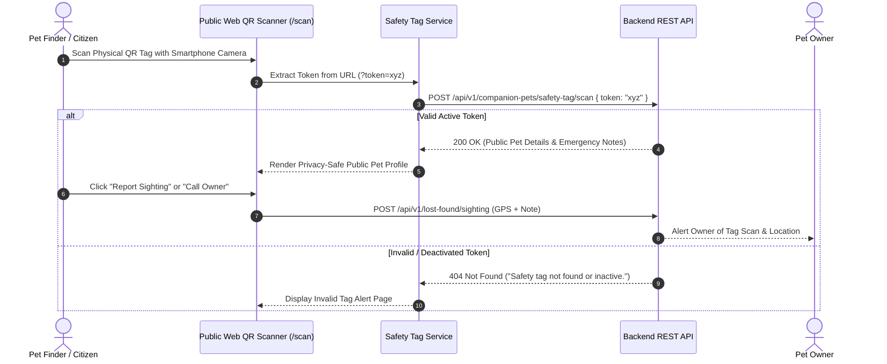

# Module 02 — QR Safety Tag System

Status: **IMPLEMENTED / PRODUCTION-READY**

## Subsystem Overview

The PawGuard QR Safety Tag system provides a digital safety net for companion pets and shelter animals. Each registered pet can be provisioned with a unique, encrypted QR safety tag. When a physical collar tag is scanned by a citizen using a smartphone camera or the built-in PawGuard web scanner, the Public Web application resolves the token and renders a privacy-safe public pet profile with instant owner contact relay and sighting submission capabilities.

---

## API Integration Schema

| Method | Endpoint | Access | Purpose |
|---|---|---|---|
| `POST` | `/api/v1/companion-pets/safety-tag/scan` | Public | Resolves a safety tag token to public pet details (`SafetyTagScanResponse`) |
| `GET` | `/api/v1/dogs/{dog_id}/public-scan` | Public | Resolves a rescue dog ID to public profile (`PublicDogScanResponse`) |
| `GET` | `/api/v1/companion-pets/{pet_id}/safety-tag` | Owner Auth | Reads safety tag metadata without revealing the raw token |
| `POST` | `/api/v1/companion-pets/{pet_id}/safety-tag` | Owner Auth | Provisions a new QR tag or rotates an existing tag token |
| `DELETE` | `/api/v1/companion-pets/{pet_id}/safety-tag` | Owner Auth | Deactivates/revokes an active QR safety tag |

---

## Frontend Components & Routes

* **Route Entrypoint:** `/scan` (`src/app/scan/page.tsx`)
* **Main Scan Page:** `src/app/pages/ScanPage.tsx`
* **Camera Scanner Component:** `src/app/components/scan/QrScanner.tsx` (backed by `html5-qrcode` & `jsqr`)
* **Service Module:** `src/services/api/safety-tag/index.ts`
* **DTO Schemas:** `src/lib/api/types.ts` (`SafetyTagScanRequest`, `SafetyTagScanResponse`, `PublicDogScanResponse`, `SafetyTagResponse`, `SafetyTagProvisionResponse`)

---

## Token Resolution & Processing

1. **Token Extraction:** When a tag URL is opened (`https://pawguard-web-v2.vercel.app/scan?token=<token>`), `sanitizeScanToken()` strips full URL wrappers, query string noise, and quotes to extract clean token strings.
2. **Rescue Dog UUID Check:** `isUuid()` identifies token format to route rescue dog profiles to `getDogPublicScan(dogId)`.
3. **API Resolution:** Calls `POST /companion-pets/safety-tag/scan` sending `{ token }`.
4. **Invalid Tag Handling:** Returns 404 `NOT_FOUND` ("Safety tag not found or inactive"), rendering a clean error alert with manual entry input options.
5. **Crawler Shielding:** `src/app/robots.ts` excludes `/scan?*` from search engine crawler indexing to prevent tokenized query parameters from leaking into search engine indexes.

---

## Privacy & Medical Information Boundaries

### Publicly Exposed Scan Data
* Pet name, species, breed, and color
* Pet photo (`photo_url` / `photo_gallery_urls`)
* Care-critical emergency notes (`emergency_notes` — e.g. "Diabetic - requires daily insulin", "Deaf", "Allergic to penicillin")
* Current status (`safe`, `lost`, `found`, `reunited`)
* Reported lost location & lost timestamp (if pet status is `lost`)
* Interactive action buttons allowing finder to send sighting location report or initiate contact via backend relay

### Masked & Protected Private Data
* Owner full name (NOT exposed in scan payload)
* Owner personal phone number (NOT exposed in plain text)
* Owner personal email address (NOT exposed)
* Owner home street address (NOT exposed)
* Private clinical medical records, vaccination logs, and vet billing histories (STRICTLY EXCLUDED)

*Note: Care-critical `emergency_notes` are exposed specifically to protect pet life and health during an emergency encounter. Full clinical medical histories are restricted to authenticated owners under `/account/pets/[id]/reminders`.*
