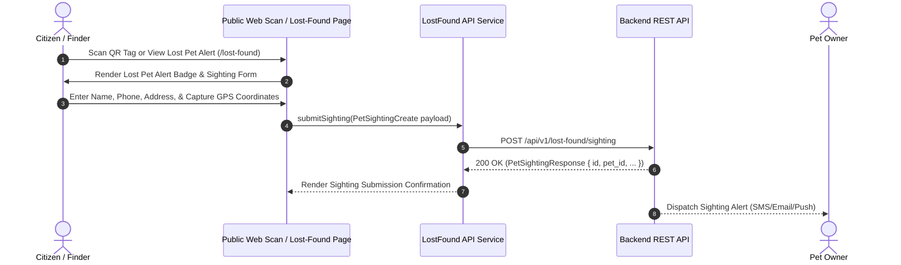

# Module 03 — Lost & Found Pet Alert Subsystem

Status: **IMPLEMENTED / PRODUCTION-READY**

## Subsystem Overview

The Lost & Found Pet Alert Subsystem enables pet owners to broadcast lost pet alerts across the PawGuard network and allows public citizens to view active lost pets and submit location sighting reports. Finders scanning a lost pet's QR tag or viewing a lost alert can submit GPS coordinates, physical address notes, finder phone details, and location messages without needing an account.

---

## API Integration Schema

| Method | Endpoint | Access | Purpose |
|---|---|---|---|
| `POST` | `/api/v1/lost-found/sighting` | Public | Submits a lost pet sighting report from a citizen or QR finder |
| `GET` | `/api/v1/lost-found/lost` | Public | Fetches paginated directory of active lost pet alerts |
| `GET` | `/api/v1/lost-found/found` | Public | Fetches paginated directory of community found pet reports |
| `GET` | `/api/v1/lost-found/lost/{id}` | Public | Fetches detailed lost pet report and location history |
| `POST` | `/api/v1/lost-found/lost` | Owner Auth | Creates a new lost pet alert broadcast |
| `POST` | `/api/v1/lost-found/lost/{id}/broadcast` | Owner Auth | Triggers network broadcast for lost pet alert |

---

## Frontend Components & Routes

* **Main Directory Route:** `/lost-found` (`src/app/lost-found/page.tsx`)
* **Report Submission Pages:** `/lost-found/report`, `/lost-found/[id]`
* **Scan Sighting Integration:** `src/app/pages/ScanPage.tsx`
* **Service Module:** `src/services/api/lost-found/index.ts`
* **DTO Schemas:** `src/lib/api/types.ts` (`PetSightingCreate`, `PetSightingResponse`, `LostReportCreate`, `LostFoundCase`)

---

## Sighting Submission Workflow

1. **Trigger:** Finder opens `/scan?token=<token>` or views lost pet details on `/lost-found/[id]`.
2. **Form Input:**
   * `finder_name` (Required)
   * `finder_phone` (Required; validated using `validatePhone()`)
   * `location_address` (Required; physical landmark or street address)
   * `finder_address` (Optional)
   * `message` (Optional notes)
   * `latitude` / `longitude` (Captured via browser HTML5 Geolocation API button)
3. **Submission:** Invokes `lostFoundService.reportSighting(data)` sending `PetSightingCreate` to `POST /api/v1/lost-found/sighting`.
4. **Finder Privacy Safeguard:** The submission alerts the pet owner via backend dispatch without revealing private owner phone numbers or home addresses to the public finder.
