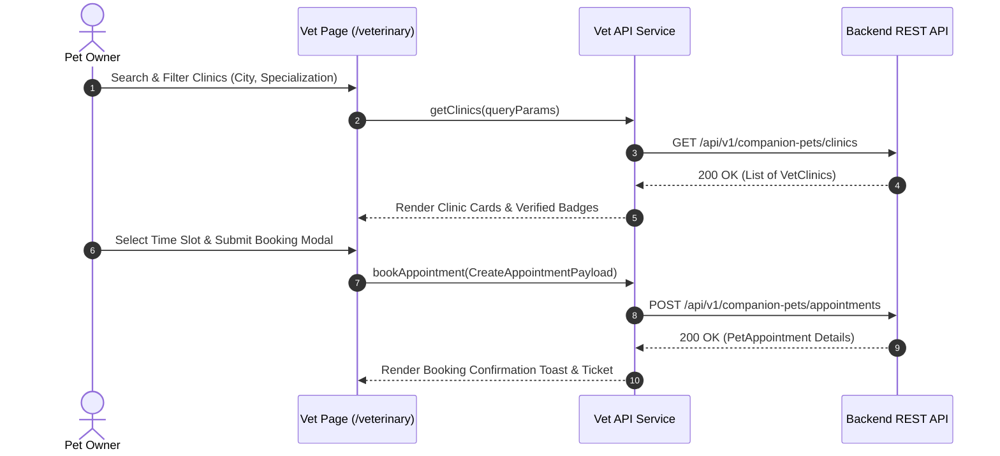

# Module 04 — Veterinarian Directory & Appointment Booking

Status: **IMPLEMENTED / PRODUCTION-READY**

## Subsystem Overview

The Veterinarian Directory & Appointment Booking module provides a searchable index of verified veterinary clinics, hospitals, and specialists. Pet owners can filter clinics by specialization, city, rating, and availability, view detailed clinic profiles, select available appointment time slots, and complete online appointment bookings.

---

## API Integration Schema

| Method | Endpoint | Access | Purpose |
|---|---|---|---|
| `GET` | `/api/v1/companion-pets/clinics` | Public | Fetches paginated directory of verified vet clinics |
| `GET` | `/api/v1/companion-pets/clinics/{id}` | Public | Fetches clinic profile, address, operating hours, & services |
| `POST` | `/api/v1/companion-pets/appointments` | Owner Auth | Books a new veterinary appointment slot |
| `GET` | `/api/v1/companion-pets/appointments` | Owner Auth | Fetches current user's appointment history |
| `POST` | `/api/v1/companion-pets/appointments/{id}/cancel` | Owner Auth | Cancels a scheduled appointment |

---

## Frontend Components & Routes

* **Directory Search Route:** `/veterinary` (`src/app/veterinary/page.tsx`)
* **Appointment Booking Pages:** `/appointments`, `/vets/[id]/book`
* **Service Module:** `src/services/api/appointments/index.ts` & `src/services/api/pets/index.ts`
* **DTO Schemas:** `src/lib/api/types.ts` (`VetClinic`, `PetAppointment`, `CreateAppointmentPayload`)

---

## Key Features

1. **Clinic Search & Filters:** Search clinics by name, city, emergency availability, or medical specialty.
2. **Verified Badge Display:** Indicates verified vet network members.
3. **Slot Booking Picker:** Allows selection of date, time slot, pet profile, and reason for visit.
4. **Appointment Management:** Owner dashboard displays upcoming appointments with cancellation controls.
