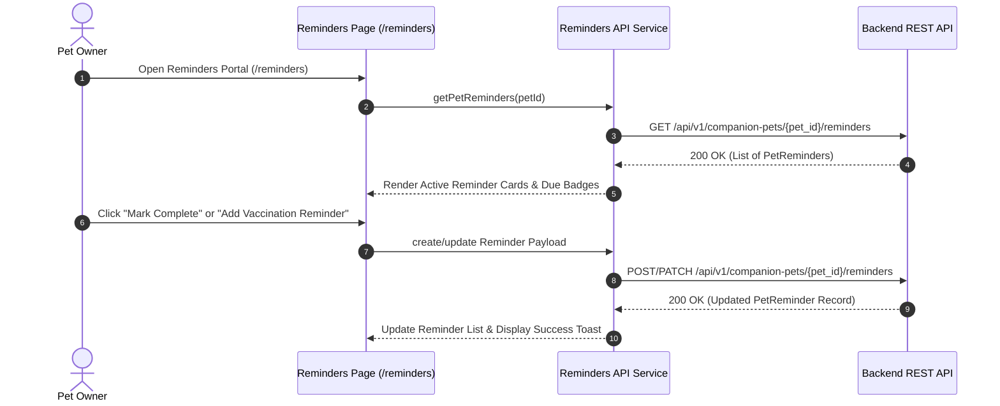

# Module 05 — Pet Health & Medical Reminders

Status: **IMPLEMENTED / PRODUCTION-READY**

## Subsystem Overview

The Pet Health & Medical Reminders module provides registered pet owners with automated tracking for vaccination schedules, deworming cycles, medication doses, and routine veterinary checkups. Pet owners can view, create, edit, mark complete, or delete care reminders for their registered companion animals.

---

## API Integration Schema

| Method | Endpoint | Access | Purpose |
|---|---|---|---|
| `GET` | `/api/v1/companion-pets/{pet_id}/reminders` | Owner Auth | Fetches reminder schedule for owner's registered pet |
| `POST` | `/api/v1/companion-pets/{pet_id}/reminders` | Owner Auth | Creates a new medical, vaccination, or care reminder |
| `PATCH` | `/api/v1/companion-pets/{pet_id}/reminders/{reminder_id}` | Owner Auth | Updates reminder due date, notes, or completion status |
| `DELETE` | `/api/v1/companion-pets/{pet_id}/reminders/{reminder_id}` | Owner Auth | Deletes a care reminder |
| `GET` | `/api/v1/medical/dogs/{dog_id}/reminders` | Owner Auth | Fetches automated dog vaccination/deworming reminders |

---

## Frontend Components & Routes

* **Main Reminders Route:** `/reminders` (`src/app/reminders/page.tsx`)
* **Pet-Specific Reminders Route:** `/account/pets/[id]/reminders`
* **Service Module:** `src/services/api/reminders/index.ts`
* **DTO Schemas:** `src/lib/api/types.ts` (`PetReminder`, `CreateReminderPayload`)

---

## Medical Privacy Boundaries

* **Authenticated Owner Access:** Full vaccination history, care schedules, and custom medical reminders are accessible **ONLY** by logged-in pet owners under `/account/pets/[id]/reminders`.
* **Public QR Scanning Boundary:** Public QR scans (`/scan?token=...`) display **ONLY** care-critical `emergency_notes` (e.g. allergies, chronic conditions) necessary for immediate pet safety. Full clinical medical records and vaccination logs are **STRICTLY EXCLUDED** from public QR scans.
