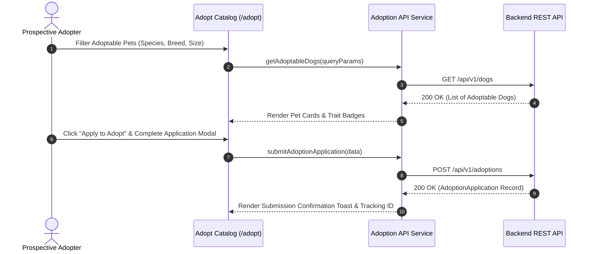

# Module 06 — Adoption & Rescue Catalog

Status: **IMPLEMENTED / PRODUCTION-READY**

## Subsystem Overview

The Adoption & Rescue Catalog module provides a public directory of adoptable shelter animals and rescue dogs. Prospective adopters can search and filter animals by species, breed, age, size, gender, and temperament, view photo galleries and medical background, submit online adoption applications, and apply for foster-to-adopt placements.

---

## API Integration Schema

| Method | Endpoint | Access | Purpose |
|---|---|---|---|
| `GET` | `/api/v1/dogs` | Public | Fetches paginated directory of adoptable shelter dogs |
| `GET` | `/api/v1/dogs/{id}` | Public | Fetches detailed profile, photo gallery, & health history |
| `GET` | `/api/v1/dogs/{id}/public-scan` | Public | Fetches privacy-safe public scan profile for a rescue dog |
| `POST` | `/api/v1/adoptions` | User Auth | Submits a new adoption application for a specific pet |
| `GET` | `/api/v1/adoptions/my` | User Auth | Fetches current user's submitted adoption applications |
| `POST` | `/api/v1/fosters/apply` | User Auth | Submits a foster program application |

---

## Frontend Components & Routes

* **Main Adoption Catalog:** `/adopt` (`src/app/adopt/page.tsx`)
* **Pet Detail Page:** `/adopt/[id]`
* **Foster Program Route:** `/foster` (`src/app/foster/page.tsx`)
* **Adoption Agreement Page:** `/adoption-agreement`
* **Application Tracking Page:** `/applications` (`src/app/applications/page.tsx`)
* **Service Module:** `src/services/api/adoption/index.ts` & `src/services/api/foster/index.ts`
* **DTO Schemas:** `src/lib/api/types.ts` (`PublicDogScanResponse`, `AdoptionApplication`, `FosterApplication`)

---

## Key Features

1. **Multi-Trait Filtering:** Search adoptable animals by species, breed classification (pure/mix/unknown), estimated age, gender, weight, and temperament (friendly, high energy, pack compatible, cat/child safe).
2. **Rescue Dog QR Profiles:** Public QR scans resolving to shelter dogs call `GET /dogs/{id}/public-scan` to display adoptability status and shelter registration numbers.
3. **Foster-to-Adopt Conversion:** Foster parents can request to permanently convert a foster placement into an adoption (`POST /fosters/placements/{id}/convert-to-adopt`).
