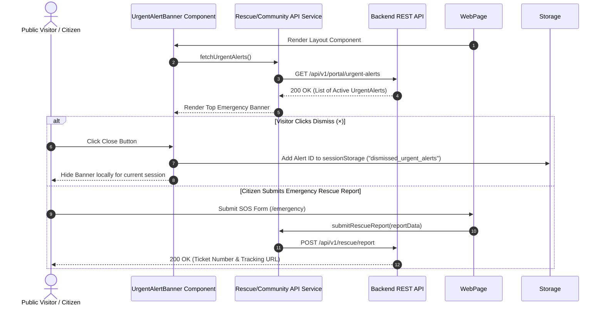

# Module 07 — Emergency & Urgent Rescue Alert System

Status: **IMPLEMENTED / PRODUCTION-READY**

## Subsystem Overview

The Emergency & Urgent Rescue Alert System handles high-severity rescue alerts and citizen SOS dispatching. Active urgent rescue alerts are fetched from the backend and rendered in a site-wide top announcement banner (`UrgentAlertBanner.tsx`). Public visitors can dismiss alerts locally for their browser session. Citizens encountering injured or distressed animals can submit emergency rescue dispatch requests with photos and location details.

---

## API Integration Schema

| Method | Endpoint | Access | Purpose |
|---|---|---|---|
| `GET` | `/api/v1/portal/urgent-alerts` | Public | Fetches active high-severity urgent rescue alerts |
| `POST` | `/api/v1/public/rescue/report` | Public | Citizen submission of an emergency animal rescue report |
| `GET` | `/api/v1/public/rescue/track/{ticketNumber}` | Public | Tracks status of a submitted emergency rescue report |
| `POST` | `/api/v1/rescue/media-upload-url` | Public | Requests S3 presigned URL for attaching rescue photos |

---

## Frontend Components & Routes

* **Emergency Dispatch Page:** `/emergency` (`src/app/emergency/page.tsx`)
* **Site-Wide Banner Component:** `src/app/components/UrgentAlertBanner.tsx`
* **Service Module:** `src/services/api/rescue/index.ts` & `src/services/api/community/index.ts`
* **DTO Schemas:** `src/lib/api/types.ts` (`UrgentAlert`, `RescueReportCreate`, `RescueTicketStatus`)

---

## Banner Session Dismissal Behavior

* **Session Scope:** Public visitors can dismiss individual alert cards by clicking the close (`×`) button.
* **`sessionStorage` Persistence:** Dismissed alert IDs are stored in browser `sessionStorage` under the key `dismissed_urgent_alerts`.
* **Visitor-Scoped Isolation:** Banner dismissal hides the banner for the current visitor's browser session only.
* **Backend Integrity:** Dismissing a banner locally does **NOT** delete, resolve, or deactivate the backend alert record. The backend API remains the authoritative source of truth for active alerts.
