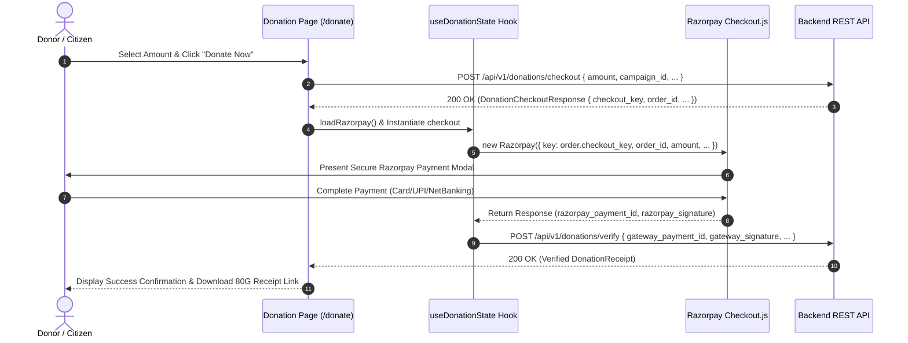

# Module 08 — Donations & Payments Integration

Status: **IMPLEMENTED / PRODUCTION-READY**

## Subsystem Overview

The Donations & Payments module manages financial contributions, pet sponsorships, and 80G tax receipt issuance. It integrates the **Razorpay Web Checkout SDK** for processing payments. The frontend requests order creation from the backend API, loads the client SDK modal, captures transaction signatures, and submits payment verification payloads for validation.

---

## API Integration Schema

| Method | Endpoint | Access | Purpose |
|---|---|---|---|
| `POST` | `/api/v1/donations/checkout` | Public / User | Creates a payment checkout order and returns `order.checkout_key` |
| `POST` | `/api/v1/donations/verify` | Public / User | Verifies gateway payment signature and issues receipt |
| `GET` | `/api/v1/donations/history` | User Auth | Fetches logged-in user's donation history |
| `GET` | `/api/v1/donations/{id}/receipt` | User Auth | Fetches signed download URL for 80G tax receipt |
| `GET` | `/api/v1/donations/campaigns` | Public | Fetches active fundraising campaigns |
| `POST` | `/api/v1/donations/sponsorships` | User Auth | Creates a monthly or one-time pet sponsorship |

---

## Frontend Components & Routes

* **Main Donation Portal:** `/donate` (`src/app/donate/page.tsx`)
* **State Management Hook:** `src/app/hooks/useDonationState.ts`
* **Donation History Tab:** `/account/donations` (`src/app/account/donations/page.tsx`)
* **Service Module:** `src/services/api/donation/index.ts`
* **DTO Schemas:** `src/lib/api/types.ts` (`DonationCheckoutRequest`, `DonationCheckoutResponse`, `DonationVerifyRequest`, `DonationReceipt`)

---

## Razorpay Integration Principles

1. **Dynamic Public Key Provisioning:** The backend returns the public Razorpay checkout key in the checkout order response payload as `order.checkout_key`. The frontend uses this value dynamically when instantiating `new Razorpay({ key: order.checkout_key, ... })`. As a result, no `NEXT_PUBLIC_RAZORPAY_KEY_ID` frontend environment variable is required in `.env.local`.
2. **Verification Payload:** Payment completion submits the following fields to `POST /api/v1/donations/verify`:
   * `gateway_payment_id`: `response.razorpay_payment_id`
   * `gateway_signature`: `response.razorpay_signature`
   * `gateway_order_id`: `response.razorpay_order_id`
3. **Secret Security:** All private Razorpay Secret Keys and Webhook signing secrets are stored strictly on the backend server.
