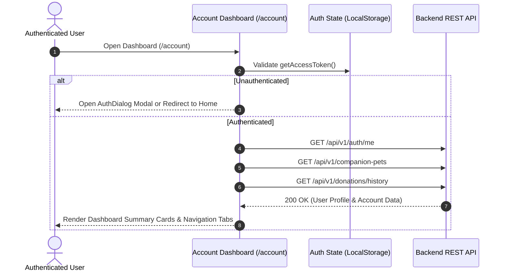

# Module 09 — User Account & Dashboard

Status: **IMPLEMENTED / PRODUCTION-READY**

## Subsystem Overview

The User Account & Dashboard module provides authenticated pet owners, adopters, volunteers, and donors with a centralized portal (`/account/*`) to manage their user profile, registered companion pets, safety tags, submitted adoption/foster applications, donation receipts, and contact/grievance support tickets.

---

## API Integration Schema

| Method | Endpoint | Access | Purpose |
|---|---|---|---|
| `GET` | `/api/v1/auth/me` | User Auth | Fetches current user's profile and session metadata |
| `PATCH` | `/api/v1/auth/me` | User Auth | Updates user profile details (name, phone, address) |
| `GET` | `/api/v1/companion-pets` | User Auth | Fetches list of companion pets registered to current user |
| `POST` | `/api/v1/companion-pets` | User Auth | Registers a new companion pet record |
| `GET` | `/api/v1/donations/history` | User Auth | Fetches user's tax receipt history |
| `GET` | `/api/v1/grievance/me` | User Auth | Fetches user's submitted grievance support tickets |
| `POST` | `/api/v1/auth/logout` | User Auth | Revokes current JWT session token |

---

## Protected Dashboard Tab Hierarchy

1. **Overview Tab (`/account`):** Displays quick actions, registered pet count, active lost alerts, and recent donation receipts.
2. **My Pets Tab (`/account/pets`):** Allows registering new pets, editing pet profiles, adding photos, and managing/provisioning QR safety tags.
3. **Donations & Receipts (`/account/donations`):** Lists completed donations with direct 80G PDF receipt download links.
4. **My Tickets & Inquiries (`/account/tickets`):** Tracks status of submitted grievance tickets and contact inquiries.
5. **Account Settings (`/account/settings`):** Password changes, email verification, and security options.
