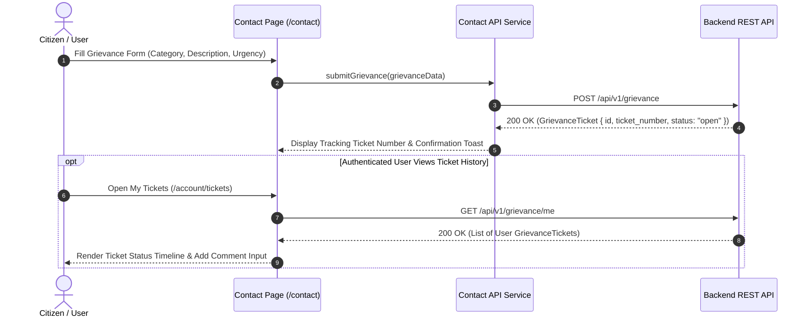

# Module 10 — Contact & Grievance Subsystem

Status: **IMPLEMENTED / PRODUCTION-READY**

## Subsystem Overview

The Contact & Grievance Subsystem manages public inquiries and formal citizen grievance ticket submissions. Public citizens can browse FAQ knowledge bases, locate physical animal shelter centers, and submit contact inquiries or formal grievances. Authenticated citizens can track ticket progress, view SLA resolution timelines, and add comments to open tickets directly from their user dashboard.

---

## API Integration Schema

| Method | Endpoint | Access | Purpose |
|---|---|---|---|
| `POST` | `/api/v1/grievance` | Public / User | Submits a new formal grievance support ticket |
| `POST` | `/api/v1/grievance/feedback` | Public | Submits general site feedback or contact inquiry |
| `GET` | `/api/v1/portal/contact` | Public | Fetches shelter center physical addresses & phone contacts |
| `GET` | `/api/v1/portal/faq` | Public | Fetches public FAQ knowledge base categories |
| `GET` | `/api/v1/grievance/me` | User Auth | Fetches current user's submitted grievance tickets |
| `GET` | `/api/v1/grievance/me/{id}` | User Auth | Fetches detailed ticket thread & status history |
| `POST` | `/api/v1/grievance/me/{id}/comments` | User Auth | Posts a user follow-up comment to an open ticket |

---

## Frontend Components & Routes

* **Contact & Inquiry Page:** `/contact` (`src/app/contact/page.tsx`)
* **User Ticket Dashboard:** `/account/tickets`
* **Service Module:** `src/services/api/contact/index.ts`
* **DTO Schemas:** `src/lib/api/types.ts` (`GrievanceTicket`, `GrievanceCreatePayload`, `GrievanceComment`)

---

## Key Features

1. **Dual Inquiry Channels:** Distinguishes general contact feedback (`POST /grievance/feedback`) from formal tracked grievance tickets (`POST /grievance`).
2. **Ticket Tracking Numbers:** Submitting a formal grievance issues a unique tracking code (e.g. `GRV-2026-8812`).
3. **Interactive Thread Comments:** Authenticated users can view ticket status updates (`open`, `in_progress`, `resolved`, `closed`) and reply to staff comments.
