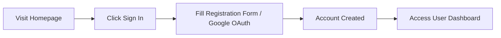
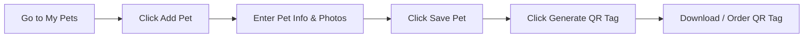
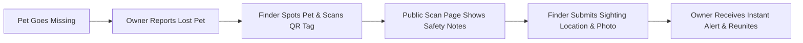
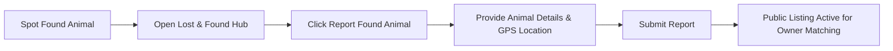
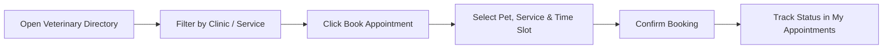
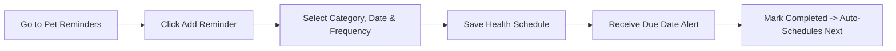
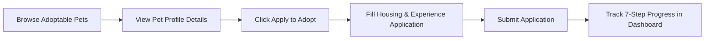
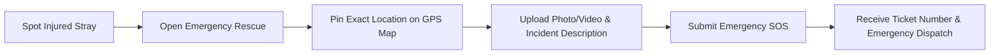
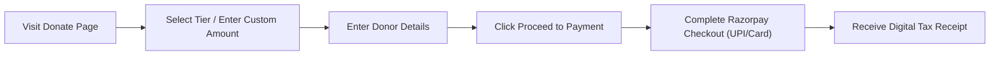
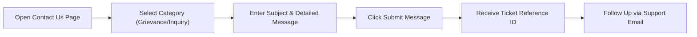

# PawGuard Public Web — End User Manual

Welcome to the official End User Manual for the **PawGuard Public Web Application**. This comprehensive guide provides step-by-step instructions for pet owners, animal lovers, finders, and community members using PawGuard to protect, adopt, rescue, and care for animals.

---

## Table of Contents

1. [About PawGuard](#1-about-pawguard)
2. [Getting Started](#2-getting-started)
3. [Home Page and Public Content](#3-home-page-and-public-content)
4. [Registration and Login](#4-registration-and-login)
5. [Google Login](#5-google-login)
6. [Account and Dashboard](#6-account-and-dashboard)
7. [Pet Management](#7-pet-management)
8. [QR Safety Tag](#8-qr-safety-tag)
9. [Lost and Found](#9-lost-and-found)
10. [Veterinarians and Appointments](#10-veterinarians-and-appointments)
11. [Pet Health and Reminders](#11-pet-health-and-reminders)
12. [Adoption and Rescue](#12-adoption-and-rescue)
13. [Emergency and Urgent Alerts](#13-emergency-and-urgent-alerts)
14. [Donations](#14-donations)
15. [Notifications](#15-notifications)
16. [Contact and Grievance](#16-contact-and-grievance)
17. [Privacy and Safety](#17-privacy-and-safety)
18. [Common Problems and Solutions](#18-common-problems-and-solutions)
19. [Complete User Journeys](#19-complete-user-journeys)
20. [Quick Reference](#20-quick-reference)

---

## 1. About PawGuard

PawGuard is an end-to-end digital platform dedicated to animal welfare, pet safety, and community rescue. The Public Web application provides accessible tools to ensure every companion and stray animal receives timely care, shelter, and protection.

### 1.1 Purpose of the Website

The PawGuard Public Web application empowers users to:
* **Protect Companion Pets:** Register pets, generate QR Safety Tags, and track vaccination & health reminders.
* **Reunite Lost & Found Animals:** Submit community lost pet alerts, report found strays, and broadcast live location sightings.
* **Adopt & Rescue:** Browse shelter animals, submit adoption applications, and track application progress through a 7-step status tracker.
* **Emergency Rescue:** Request urgent medical and rescue intervention for animals in life-threatening distress with live GPS map pinning.
* **Veterinary Access:** Locate nearby partner vet clinics, filter by emergency services, and book medical appointments.
* **Community Support:** Make transparent donations via Razorpay checkout, receive 80G tax receipts, and track support inquiries or grievance tickets.

### 1.2 Who Can Use PawGuard?

* **Pet Owners:** Register companion pets, create QR Safety Tags, track vaccinations, and manage health reminders.
* **Good Samaritans & Finders:** Scan QR tags on roaming animals, report found pets, and log GPS location sightings.
* **Animal Lovers & Adopters:** Discover adoptable shelter pets, submit adoption applications, and sponsor rescue care.
* **Emergency Responders & Citizens:** File emergency rescue reports for injured, trapped, or distressed animals.

---

## 2. Getting Started

Welcome to PawGuard Public Web! PawGuard is a modern web platform designed to protect pets, connect communities, and assist animals in need.

---

### 1. What is PawGuard Public Web?

PawGuard Public Web is the public-facing online platform accessible at [https://pawguard-web-v2.vercel.app](https://pawguard-web-v2.vercel.app). It provides animal protection tools for companion pet owners, animal lovers, finders, and volunteers.

---

### 2. Who Can Use PawGuard?

* **Pet Owners:** Register companion pets, create QR Safety Tags, track vaccinations, and manage health reminders.
* **Finders & Good Samaritans:** Scan QR tags on lost pets, report found animals, and submit location sightings.
* **Adopters:** Browse rescued dogs and cats looking for homes and submit adoption applications.
* **Community Members:** Report animal emergencies, make tax-deductible donations, and access educational resources.

---

### 3. Account Requirements & Features

#### Browsing Without an Account
You can use PawGuard without signing in to perform public tasks:
* View home page content, live rescue tickers, and urgent community alerts.
* Search the veterinarian clinic directory.
* Scan a QR Safety Tag on a found pet to view public safety notes and report a sighting.
* Report an injured animal emergency with GPS coordinates.
* Browse adoptable animals and read community success stories.
* Make a donation via Razorpay.

#### Features That Require a Free Account
Signing up takes less than 1 minute and unlocks personalized tools:
* Registering companion pets under your profile.
* Assigning and editing QR Safety Tags.
* Booking veterinary checkup appointments.
* Submitting and tracking adoption applications.
* Managing pet health schedules and reminders.
* Accessing your user dashboard, donation receipts, and real-time notifications.

---

### 4. Device & Browser Compatibility

PawGuard Public Web is fully responsive and optimized for:
* **Desktop & Laptops:** Chrome, Firefox, Safari, Edge (latest versions).
* **Smartphones & Tablets:** iOS Safari and Android Chrome.
* **Camera Access:** Required on mobile devices when scanning QR tags directly through the web scanner.
* **Location Services:** Recommended when reporting emergencies or lost/found animal sightings so your current GPS coordinates can be automatically captured.

---

## 3. Home Page and Public Content

The PawGuard home page (`/`) is the central hub of the application, designed to give visitors immediate access to rescue tools, adoptable pets, and community impact data.

---

### 1. Top Urgent Alert Banner

When a critical community emergency is active, a high-visibility banner appears at the very top of the website.
* **Purpose:** Displays time-sensitive safety alerts (e.g., severe weather pet warnings, urgent medical rescue needs).
* **Dismissal:** You can dismiss the banner by clicking the **X** icon. The dismissal is saved in your browser session for that alert ID so it won't interrupt your browsing experience.

---

### 2. Hero Banner & Live Ticker

The top section features a cinematic hero video and an interactive live ticker:
* **Live Rescue Feed:** Displays real-time updates on active rescue cases, recent lost pet reports, and adoption milestones.
* **Quick Action Buttons:**
  * **Report Lost Pet:** Direct link to report a missing companion.
  * **Adopt a Pet:** Direct link to explore animals seeking homes.
  * **Emergency SOS:** Direct link to report an injured animal.

---

### 3. Interactive Service Cards

The home page highlights PawGuard's core services with interactive cards:
* **QR Safety Tags:** Learn how digital QR tags protect pets.
* **Lost & Found:** Understand how community reporting reunites lost animals.
* **Veterinary Care:** Access partner vet clinics and online booking.
* **Adoption & Rescue:** Discover how rescued strays find forever homes.

---

### 4. Public Content Sections

* **Success Stories (`/stories`):** Read heartwarming real-world stories of adopted pets and reunited lost animals. Click any story card to read the full journey or click **Share Your Story** (`/stories/share`) to submit your own adoption story.
* **Educational Resources (`/education`):** Articles on pet care, emergency first aid for animals, vaccination schedules, and urban stray management.
* **About PawGuard (`/about`):** Overview of PawGuard's mission, team, and animal protection partners.
* **Impact Statistics:** Transparency metrics showcasing total rescues completed, animals adopted, and active QR tags in the community.

---

## 4. Registration and Login

Signing up for a PawGuard account is free, fast, and secure.

---

### 1. Opening the Sign In / Sign Up Dialog

You can open the authentication window at any time:
* **Desktop:** Click the **Sign in** button in the top right of the navigation bar.
* **Mobile:** Open the menu panel and tap **Sign in / Create account**.

---

### 2. Creating a New Account (Sign Up)

To register a new account:
1. Open the sign-in modal and switch to the **Sign Up** tab.
2. Enter your required details:
   * **Full Name:** Your complete display name.
   * **Email Address:** Your valid email address (used for sign-in and notifications).
   * **Phone Number:** Your contact phone number.
   * **Password:** A strong password (minimum 8 characters).
3. Click **Create Account**.
4. Upon successful registration, you are signed in automatically and redirected to your account dashboard.

---

### 3. Signing In to Your Account (Sign In)

If you already have an account:
1. Open the sign-in modal (defaults to the **Sign In** tab).
2. Enter your registered **Email Address** and **Password**.
3. Click **Sign In**.
4. Your user avatar and name will now appear in the header navigation.

---

### 4. Two-Factor Authentication (MFA)

If your account has Two-Step Verification (MFA) enabled:
1. After entering your password, an MFA verification step will appear.
2. Enter the 6-digit code sent to your registered device or authenticator app.
3. Click **Verify Code** to complete sign-in.

---

### 5. Forgotten Password Recovery

If you forget your password:
1. On the Sign In form, click **Forgot password?** (or visit `/auth/reset-password`).
2. Enter your registered email address.
3. Click **Send Reset Link**.
4. Check your email inbox for password reset instructions and follow the link to set a new password.

---

### 6. Signing Out

To end your session safely:
1. Click your name/avatar in the header navigation to open the account menu.
2. Select **Sign Out**.
3. You will be signed out immediately and returned to the home page.

---

## 5. Google Login

PawGuard supports instant sign-in using your existing Google account for maximum convenience and security.

---

### 1. How to Sign In with Google

1. Open the Sign In / Sign Up dialog on the website.
2. Click the **Continue with Google** button at the top of the dialog.
3. A secure Google authorization window will open:
   * Select your Google account.
   * Review the permissions (PawGuard requests basic profile info: email, full name, and avatar photo).
4. Click **Continue** / **Allow**.
5. Google will securely return you to PawGuard at `/auth/callback`, where your session is established automatically.

---

### 2. Benefits of Google Sign-In

* **No Password to Remember:** Sign in instantly with one click.
* **Automatic Profile Sync:** Your full name, email address, and Google profile picture are automatically synced to your PawGuard profile.
* **Instant Account Setup:** If you don't have a PawGuard account yet, signing in with Google creates one for you automatically.

---

### 3. Privacy & Security

* PawGuard **NEVER** receives or stores your Google password.
* Sign-in uses OAuth 2.0 with state token verification to prevent unauthorized account access.
* You can disconnect or manage app permissions at any time through your Google Account security settings.

---

## 6. Account and Dashboard

Your PawGuard User Dashboard (`/account`) is your personal control center for managing registered pets, tracking adoption applications, reviewing donations, and updating personal details.

---

### 1. Accessing Your Account

Click your avatar/name in the header navigation and select **My Account** (`/account`).

---

### 2. Dashboard Overview & Activity Summary

The main dashboard screen displays your personal activity summary:
* **Registered Pets Count:** Total companion pets registered under your account.
* **Active Applications Count:** Adoption applications currently in review.
* **Total Donations:** Lifetime donations contributed to animal welfare.
* **Lost & Found Reports:** Reports submitted or tracked by you.

---

### 3. Editing Profile Information

Under the **Profile Settings** tab:
1. View your current account details (Full Name, Email, Phone Number, Location).
2. Click **Edit Profile** to update:
   * **Full Name**
   * **Phone Number** (used for vet bookings and adoption application updates)
   * **Address / City**
3. Click **Save Changes**. Your updated profile information is saved instantly.

---

### 4. My Saved Dogs (Favorites)

While browsing adoptable pets or lost/found listings, you can click the **Heart** icon on any animal card to save it.
* **Where to find:** Go to `/account` and click **Saved Dogs**.
* **Browser Persistence:** Saved dogs remain in your favorites list so you can easily return to review them later, even if you navigate away.

---

### 5. Account Management & Security

* **Change Password:** Update your sign-in password under security settings.
* **Delete Account:** If you wish to delete your account, click **Delete Account** at the bottom of the account page. This will permanently remove your account profile from PawGuard.

---

## 7. Pet Management

Registering your companion pets on PawGuard ensures they are protected with digital profiles, QR Safety Tags, and medical reminder schedules.

---

### 1. Accessing Pet Management

Go to **My Account** -> **My Pets** (`/account/pets`).

---

### 2. Registering a New Pet

To add a pet to your account:
1. Click the **Add Pet** button.
2. Fill out the pet registration form:
   * **Pet Name:** (e.g., "Max")
   * **Species:** Dog, Cat, or Other companion animal.
   * **Breed:** Breed name or "Mixed Breed / Indie".
   * **Gender:** Male or Female.
   * **Age / Birth Date:** Age in years/months or estimated birth date.
   * **Microchip ID:** Optional microchip number if applicable.
   * **Emergency Care Notes:** Important medical or behavioral instructions (e.g., "Requires daily insulin", "Allergic to penicillin", "Skittish around loud noises").
   * **Photo Upload:** Upload a clear photo of your pet.
3. Click **Save Pet**. Your pet's profile is now created.

---

### 3. Managing Registered Pets

Your **My Pets** dashboard lists all your registered animals:
* **View Details:** Click any pet card to view their full profile, assigned QR tag, and health schedule.
* **Edit Profile:** Click **Edit Pet** to update photos, age, care notes, or microchip information.
* **Remove Pet:** If a pet has passed away or been rehomed, you can archive or delete the pet profile.

---

### 4. Connecting Pets to Other Features

Once a pet is registered, you can:
* Generate a **QR Safety Tag** for their collar (see Section 07).
* Schedule **Vaccination & Health Reminders** (see Section 10).
* Book **Veterinary Appointments** directly for that pet (see Section 09).
* Instant-report if the pet ever goes missing (see Section 08).

---

## 8. QR Safety Tag

The PawGuard QR Safety Tag is a digital protection tool that links a physical collar tag to your pet's PawGuard profile.

---

### 1. What is a QR Safety Tag?

A QR Safety Tag is a scannable QR code worn on a pet's collar. If your pet strays or gets lost, anyone who finds your pet can scan the tag with any smartphone camera to instantly access vital safety instructions and contact PawGuard to report a sighting.

---

### 2. Generating & Assigning a QR Tag (Owner Guide)

1. Go to **My Pets** (`/account/pets`) and select your pet.
2. Click **Generate QR Safety Tag**.
3. A unique QR Safety Tag code is generated and linked to your pet.
4. You can download the digital QR code image or order a physical scannable collar tag.

---

### 3. What Happens When Someone Scans the Tag? (Finder Guide)

When a finder scans the QR tag on a found pet:
1. Their smartphone camera opens the public scan page (`/scan` or `/api/v1/dogs/{id}/public-scan`).
2. **What Information Is Displayed (Public Care Information):**
   * Pet Name & Photo
   * Species & Breed
   * Lost Status Indicator (e.g., "REPORTED LOST")
   * **Emergency Care Notes:** Medical conditions, allergies, dietary needs, or handling instructions provided by the owner.
3. **What Information Is NOT Displayed (Strict Privacy Boundary):**
   * **Owner's Phone Number:** Kept strictly private.
   * **Owner's Email Address:** Kept strictly private.
   * **Owner's Home Address:** Kept strictly private.
   * **Full Medical/Vaccination Records:** Kept strictly private.

---

### 4. Reporting a Sighting via Public QR Scan

If you have found a tagged pet:
1. On the public scan page, click **Report Sighting**.
2. Enter the sighting details:
   * **Location:** Current address or tap **Use Current Location** to capture GPS coordinates automatically.
   * **Condition Note:** (e.g., "Safe in my yard", "Appears healthy", "Slightly scared").
   * **Photo Upload:** Optional photo of the animal at the sighting spot.
   * **Finder Contact:** Optional phone number if you wish to allow PawGuard or the owner to contact you.
3. Click **Submit Sighting Report**.
4. The owner receives an immediate notification on their PawGuard account with the exact sighting location map and notes!

---

## 9. Lost and Found

The PawGuard Lost & Found Hub (`/lost-found`) helps reunite missing pets with their families through community reporting, search filters, and location sightings.

---

### 1. Browsing Lost & Found Listings

Visit `/lost-found` to view all community reports:
* **Filter by Status:** Select **Lost Pets** (missing companion animals) or **Found Animals** (strays/found pets reported by finders).
* **Search & Filter:** Search by breed, city/area, or date reported.
* **Listing Cards:** Display animal photos, last seen location, date, and status badges.

---

### 2. Reporting a Lost Pet (Owner Guide)

If your companion pet goes missing:
1. Go to `/lost-found` and click **Report Lost Pet** (or visit `/lost-found/report/lost`).
2. Fill out the report form:
   * **Select Pet:** Choose one of your registered pets (or enter pet details manually).
   * **Last Seen Location:** Address, landmark, or area where the pet went missing.
   * **Date & Time Lost:** When the pet was last seen.
   * **Distinctive Features:** Collar color, markings, microchip status.
   * **Contact Preferences:** Choose how you prefer to be notified.
   * **Photos:** Upload clear, recent photos of your pet.
3. Click **Submit Lost Report**.
4. Your pet's status updates to "LOST", and a public listing is created to alert nearby community members.

---

### 3. Reporting a Found Animal (Finder Guide)

If you have found a stray or lost pet in your neighborhood:
1. Go to `/lost-found` and click **Report Found Pet** (or visit `/lost-found/report/found`).
2. Fill out the report form:
   * **Animal Type:** Dog, Cat, or Other.
   * **Breed / Appearance:** Color, size, gender if known.
   * **Collar / Tag Details:** Describe any collar worn (or mention if a QR tag is present).
   * **Found Location:** Exact location where you spotted or secured the animal.
   * **Current Status:** Mention if the animal is secured in your home, at a shelter, or still roaming in the area.
   * **Photo:** Upload a photo of the found animal.
3. Click **Submit Found Report**.

---

### 4. Submitting a Sighting Report

If you spot an animal listed in a Lost Pet report:
1. Open the Lost Pet report detail page (`/lost-found/[id]`).
2. Click **Report Sighting**.
3. Provide your current location, date/time spotted, animal condition, and an optional photo.
4. Click **Submit Sighting**. The owner is notified immediately.

---

### 5. Resolving a Lost Report (Reunited!)

When your pet is safely reunited:
1. Go to your report page.
2. Click **Mark as Reunited**.
3. Your report status updates to "REUNITED", celebrating the happy outcome with the community!

---

## 10. Veterinarians and Appointments

PawGuard connects pet owners with trusted partner veterinary clinics for checkups, vaccinations, emergency care, and consultations.

---

### 1. Searching the Veterinary Directory

Visit `/veterinary` to explore partner vet clinics:
* **Search by Location:** Enter your area, city, or pincode.
* **Filter by Service:** General Checkup, Vaccination, Surgery, Dental Care, Emergency / Critical Care.
* **Clinic Profiles:** View clinic photos, address, operating hours, contact details, and user ratings.

---

### 2. Booking a Veterinary Appointment

To book an appointment online:
1. Click **Book Appointment** on any clinic profile (or visit `/appointments/book`).
2. Complete the appointment booking form:
   * **Select Companion Pet:** Choose a registered pet from your account.
   * **Service Required:** Select the reason for visit (e.g., Annual Vaccination, General Wellness Checkup, Consultation).
   * **Preferred Date:** Select an available date from the calendar.
   * **Time Slot:** Choose your preferred morning or afternoon time slot.
   * **Notes / Symptoms:** Describe any specific health concerns or symptoms.
3. Click **Confirm Appointment**.
4. You will receive an on-screen booking confirmation, and the appointment will appear under your appointments dashboard.

---

### 3. Managing Your Appointments

Go to **My Appointments** (`/appointments`):
* **View Scheduled Appointments:** Review upcoming visits, clinic address, and time slots.
* **Appointment Status:** Track whether your appointment is **Scheduled**, **Confirmed**, **Completed**, or **Cancelled**.
* **Cancel Appointment:** If you cannot attend, click **Cancel Appointment** at least 2 hours before your scheduled time slot.

---

## 11. Pet Health and Reminders

Never miss a vaccination or health treatment! PawGuard provides a dedicated Pet Health & Reminders tool (`/reminders`) to keep your pets on schedule.

---

### 1. Supported Health Reminders

You can set up reminders for:
* **Vaccinations:** Rabies, DHPP, FVRCP, Booster shots.
* **Deworming & Parasite Control:** Internal deworming tablets, flea & tick spot-on treatments.
* **Veterinary Visits:** Routine checkups, dental cleanings, blood tests.
* **Medication & Daily Care:** Special prescription schedules.

---

### 2. Creating a Health Reminder

To set a reminder for a pet:
1. Go to `/reminders` and click **Add Reminder**.
2. Fill out the reminder form:
   * **Select Pet:** Choose your registered pet.
   * **Reminder Category:** Vaccination, Deworming, Vet Checkup, Medication, Grooming, Other.
   * **Title / Description:** (e.g., "Annual Rabies Booster").
   * **Due Date & Time:** When the treatment is scheduled.
   * **Recurring Schedule:** One-time, Monthly, Every 3 Months, Every 6 Months, or Annual.
3. Click **Save Reminder**.

---

### 3. Managing Reminders & Receiving Alerts

* **Upcoming Reminders:** Displayed in order of due date.
* **Notification Alerts:** On the due date, an alert appears in your PawGuard Notification Bell and account dashboard.
* **Mark as Completed:** After administering the vaccine or treatment, click **Mark Completed**. If the reminder was set to recurring (e.g. Annual), PawGuard automatically calculates and schedules the next due date for you!
* **Delete Reminder:** Click the Trash icon to remove an unnecessary reminder.

---

## 12. Adoption and Rescue

PawGuard connects rescued stray and shelter animals with loving families through an interactive adoption catalog and transparent application tracking.

---

### 1. Browsing Adoptable Animals

Visit `/adopt` to explore rescued pets:
* **Filters:** Filter by species (Dog, Cat), age group (Puppy/Kitten, Young, Adult, Senior), gender, size, and location.
* **Animal Cards:** Feature photos, name, breed, age, and quick personality tags (e.g. "Friendly", "Good with cats", "Vaccinated").

---

### 2. Animal Profile Details

Click any animal card to view their full profile (`/adopt/[slug]`):
* **Photo Gallery:** High-resolution photos.
* **Bio & Background:** Story of how the animal was rescued and their temperament.
* **Health & Medical Status:** Spayed/Neutered status, vaccination history, and special care notes.
* **Adoption Requirements:** Specific housing or family requirements (e.g. "Fenced yard required").

---

### 3. Submitting an Adoption Application

If you wish to adopt an animal:
1. On the animal's profile page, click **Apply to Adopt**.
2. Complete the adoption application form:
   * **Applicant Details:** Name, Contact Phone, Full Address, Occupation.
   * **Housing Environment:** Own/Rent home, Apartment/Independent house, Fenced yard presence, Landlord approval status.
   * **Pet Experience:** Current pets in household, previous pet ownership experience, veterinarian contact.
   * **Care Plan:** Daily routine, exercise plan, and emergency care plan.
   * **Agreement:** Review and accept the PawGuard Adoption Agreement terms (`/adoption-agreement`).
3. Click **Submit Application**.

---

### 4. Tracking Your Adoption Application Status

Go to **My Applications** (`/applications`):
* **7-Step Progress Tracker:** Visual pipeline showing your application's current stage:
  1. **Submitted:** Application received.
  2. **Screening:** Initial review by rescue team.
  3. **Vetting:** Reference & vet verification.
  4. **Interview:** Phone/video conversation.
  5. **Home Check:** Virtual or in-person home safety review.
  6. **Approved:** Adoption approved!
  7. **Completed:** Handover complete & pet welcomed home!
* **Status Updates:** If additional information is needed, your application card will display notes from the adoption coordinator.

---

## 13. Emergency and Urgent Alerts

PawGuard provides emergency reporting tools (`/emergency`) to dispatch urgent aid for injured, trapped, or severely distressed animals.

---

### 1. When to Submit an Emergency Report

Use the Emergency Rescue tool if you spot:
* An injured stray or wild animal requiring immediate veterinary care.
* An animal trapped in a drain, well, construction site, or dangerous area.
* An animal in severe physical distress or extreme weather danger.

*Note: For non-urgent lost pet reports or routine inquiries, please use Lost & Found (`/lost-found`) or Contact Us (`/contact`) instead.*

---

### 2. Submitting an Emergency Rescue Report

1. Go to `/emergency` and click **Report Emergency**.
2. Complete the emergency submission form:
   * **Incident Category:** Injury / Hit-and-Run, Trapped Animal, Extreme Distress, Severe Abuse/Neglect.
   * **Animal Description:** Species, color, size, visible injuries.
   * **Exact Location / GPS Map Picker:** Enter address or tap **Use My Current Location** on the map picker (`LocationMapPicker.tsx`) to pinpoint exact GPS coordinates.
   * **Photo / Video Upload:** Upload clear photos or short video clips of the scene (`MediaUpload.tsx`).
   * **Immediate Risks:** Mention nearby hazards (e.g., "Heavy traffic road", "Deep water channel").
   * **Reporter Contact:** Your phone number so rescue volunteers can contact you for location guidance.
3. Click **Submit Emergency Rescue Report**.

---

### 3. What Happens After Submission?

1. **Confirmation Screen:** You receive an immediate Emergency Ticket Reference Number (e.g. `EMG-84920`).
2. **Rescue Notification:** PawGuard's emergency coordination team and nearby rescue partners are alerted instantly.
3. **Reporter Responsibilities:** If safe to do so, stay near the animal at a safe distance to guide responders when they arrive.

---

### 4. Urgent Community Banners

* Severe emergencies or large-scale community rescue situations trigger an **Urgent Alert Banner** at the top of the PawGuard website.
* Community members browsing the site can see active urgent alerts, share them on social media, or offer local assistance.
* **Banner Dismissal:** Clicking **X** hides the banner for your current browsing session without affecting the emergency rescue ticket.

---

## 14. Donations

PawGuard relies on generous public donations to fund stray animal feeding programs, emergency medical surgeries, shelter maintenance, and rescue operations.

---

### 1. Making a Donation

Visit `/donate` to make a contribution:
1. **Choose Giving Type:**
   * **One-Time Donation:** Single contribution.
   * **Monthly Care Sponsor:** Recurring monthly support.
   * **Specific Rescue Fund:** Contribute directly to an emergency rescue or medical case.
2. **Select Amount:** Choose a preset tier (e.g. ₹500 for feeding, ₹1,500 for vaccination, ₹5,000 for emergency surgery) or enter a custom amount.
3. **Donor Information:** Enter your Name, Email, and Phone Number (required for receipt issuance).
4. Click **Proceed to Payment**.

---

### 2. Razorpay Payment Checkout Process

PawGuard integrates directly with **Razorpay** for secure payments:
1. The official Razorpay checkout modal opens seamlessly on your screen.
2. Select your preferred payment method:
   * **UPI / QR Code:** Google Pay, PhonePe, Paytm, BHIM.
   * **Credit & Debit Cards:** Visa, Mastercard, RuPay, Maestro.
   * **NetBanking:** All major Indian banks.
   * **Wallets:** Paytm, Mobikwik, Freecharge.
3. Authorize the payment through your banking or UPI app.
4. Upon payment completion, Razorpay verifies the transaction with PawGuard's servers within seconds.

---

### 3. Post-Payment Confirmation & Receipts

* **Success Screen:** Displays your Payment ID, Order Number, Amount Paid, and Date.
* **Tax-Exempt Receipt:** A digital receipt is generated and emailed to your registered address.
* **Donation History (`/account/donations`):** Signed-in users can view their lifetime donation history and download past receipts at any time.

---

### 4. Payment Security & Support

* **100% PCI-DSS Compliant:** Payment credentials are handled entirely by Razorpay's encrypted gateway. PawGuard never sees or stores your card numbers, CVV, or UPI PIN.
* **Failed / Cancelled Payments:** If a payment fails due to bank network issues, no money is deducted. You can retry the donation at any time.

---

## 15. Notifications

The PawGuard Notification Center keeps you informed about your pets, applications, appointments, and community reports in real time.

---

### 1. Navbar Bell & Live Badge

When signed in, a **Bell icon** appears in the top header navigation bar:
* **Unread Count Badge:** Displays a red badge showing the number of unread notifications (e.g. `3` or `99+`).
* **Live Polling:** The badge updates automatically as new events occur.

---

### 2. Notification Dropdown Panel

Click the **Bell icon** to open the quick notification dropdown:
* **Recent Updates:** Displays your 6 most recent notifications.
* **Notification Types:**
  * 🚨 **Emergency & Rescue:** Updates on emergency tickets you reported or nearby alerts.
  * 🐕 **Lost & Found:** Sighting reports submitted for your lost pet.
  * 🐶 **Adoption:** Progress updates on your submitted adoption application.
  * 📅 **Appointments:** Confirmations or reminders for vet visits.
  * ⏰ **Health Reminders:** Due date alerts for vaccinations and deworming.
  * ❤️ **Donations:** Verification and receipt confirmations.
* **Mark as Read:** Click the checkmark icon to mark all dropdown items as read.
* **View All Notifications:** Click **View all notifications** at the bottom of the dropdown to open the full notification management page (`/notifications`).

---

### 3. Dedicated Notifications Page (`/notifications`)

On the full notifications screen:
* **Filter Notifications:** View All, Unread Only, or filter by category.
* **Paginated List:** Browse your complete notification history page by page.
* **Click-to-Action:** Clicking any notification item takes you directly to the relevant page (e.g. clicking an adoption update opens your application tracker page).
* **Delete Notifications:** Click the Trash icon to remove unwanted notifications from your list.

---

## 16. Contact and Grievance

PawGuard is committed to open communication, user support, and transparent grievance resolution.

---

### 1. Accessing the Contact Page

Visit `/contact` to get in touch with the PawGuard team.

---

### 2. Submitting an Inquiry or Grievance Ticket

To submit a message or report a grievance:
1. Complete the Contact form on `/contact`:
   * **Full Name:** Your complete name.
   * **Email Address:** Your email address for responses.
   * **Category:**
     * *General Inquiry:* Questions about PawGuard platform features.
     * *Adoption Information:* Questions regarding adoption requirements.
     * *Veterinary Partner Inquiry:* Clinic onboarding or appointment assistance.
     * *Grievance / Issue Report:* Reporting an issue, website problem, or service concern.
   * **Subject:** Brief description of your inquiry.
   * **Message / Grievance Details:** Provide full details, including relevant pet IDs, report numbers, or dates if applicable.
2. Click **Submit Message**.

---

### 3. What Happens After Submission?

1. **Ticket Reference ID:** You receive an on-screen confirmation with a Ticket Reference ID (e.g. `TKT-10492`).
2. **Email Confirmation:** A copy of your inquiry details and ticket number is emailed to you.
3. **Response Time:** General inquiries are typically answered within 24 to 48 hours. Grievance tickets are prioritized for swift review by our support desk.

---

### 4. PawGuard Contact Details & Office Locations

The `/contact` page also lists PawGuard's public contact information:
* **Headquarters Address:** Main office location and rescue coordinator directory.
* **Support Email:** `support@pawguard.org`
* **Emergency Helpline:** Phone helpline for urgent animal rescue guidance.
* **Operating Hours:** Customer support and rescue desk operational hours.

---

## 17. Privacy and Safety

PawGuard prioritizes the privacy and physical safety of both pet owners and animals.

---

### 1. QR Safety Tag Privacy Boundaries

Understanding what information is visible when someone scans your pet's QR tag is essential:

* **Care-Critical Information (PUBLIC):**
  * Pet Name, Photo, Breed, and Species.
  * Lost Status (e.g. "REPORTED LOST").
  * **Emergency Notes:** Medical conditions, allergies, or dietary needs provided by you to keep your pet safe if found by a stranger.

* **Owner Personal Information (STRICTLY PRIVATE & HIDDEN):**
  * **Owner Phone Number:** NOT visible on public scans.
  * **Owner Email Address:** NOT visible on public scans.
  * **Owner Home Address:** NOT visible on public scans.
  * **Full Clinical / Medical Records:** NOT visible on public scans.

* **How Finders Contact You Safely:**
  Finders use the secure **Report Sighting** form on the scan page. Sighting details (location, notes, photo) are routed directly to your private PawGuard notifications without revealing your private contact numbers to the finder unless you choose to share them.

---

### 2. Safe Public Posting Guidelines for Lost Pets

When posting a Lost Pet report:
* **Provide Last Seen Area:** Mention general landmarks or neighborhood streets rather than your exact home address.
* **Keep Microchip Numbers Private:** Do not post your pet's full microchip number publicly to prevent scam attempts.
* **Verify Sighting Reports:** If a stranger claims to have found your pet, ask for a photo or confirm specific collar markings before meeting. Meet in a safe, public daytime location.

---

### 3. Account Data Protection & Payment Safety

* **Account Passwords:** Stored using secure one-way encryption.
* **Payment Security:** All financial transactions (donations) are processed through **Razorpay** using 256-bit SSL encryption. PawGuard does NOT store bank account numbers, credit card details, or UPI PINs.
* **Legal Terms:** Review our full terms and privacy policies anytime at `/privacy` and `/terms`.

---

## 18. Common Problems and Solutions

Quick solutions for common issues encountered while using the PawGuard Public Web application.

---

### 1. Sign In & Account Issues

#### Problem: "Invalid email or password" error
* **Solution:** Verify you are using the exact email address registered with PawGuard. Ensure Caps Lock is off. If you forgot your password, click **Forgot password?** to reset it.

#### Problem: Google Sign-In pop-up closes or blocks
* **Solution:** Ensure your browser is not blocking pop-up windows for PawGuard. If using Incognito / Private Browsing mode, disable third-party cookie blocking for Google sign-in.

#### Problem: "Session Expired" message
* **Solution:** For security, user sessions expire after a period of inactivity. Simply open the Sign In dialog and re-enter your credentials to resume your session.

---

### 2. QR Tag & Scan Issues

#### Problem: Smartphone camera will not scan the QR tag
* **Solution:** Ensure your phone camera lens is clean and adequate lighting is available. If using the web scanner on `/scan`, allow camera permissions when prompted by your browser.

#### Problem: Location picker is inaccurate or will not load
* **Solution:** Check your browser's location permission settings. Ensure GPS/Location Services are turned ON on your smartphone and grant location access to PawGuard.

---

### 3. Form Submission & Media Upload Issues

#### Problem: Photo upload fails or shows error
* **Solution:** PawGuard supports image formats (JPG, PNG, WEBP). Ensure each photo file size is under 10 MB. If uploading multiple photos, upload them one at a time.

#### Problem: Submit button is disabled or unresponsive
* **Solution:** Scroll through the form to check for missed required fields marked with a red asterisk (`*`), such as missing phone numbers or unselected checkboxes.

---

### 4. Payment & Donation Issues

#### Problem: Razorpay payment window closes or fails
* **Solution:** Check your internet connection. If deducted, money is automatically refunded by your bank within 3 to 5 business days. You can retry the payment using UPI or another payment method.

#### Problem: Donation receipt not received
* **Solution:** Check your email Spam/Junk folder. If you were signed in during donation, go to **My Account** -> **Donations** (`/account/donations`) to download your digital receipt.

---

### 5. Contacting Technical Support

If your problem is not resolved by the steps above:
1. Visit the [Contact Us](file:///c:/Users/Dell/Desktop/PawGuard%20Homepage%20Design%20%282%29/PawGuard%20Homepage%20Design/docs/PAWGUARD_PUBLIC_WEB_USER_MANUAL/15-contact-and-grievance/README.md) page (`/contact`).
2. Select **Grievance / Issue Report**.
3. Describe the problem, including the device, browser, and error message displayed.
4. Click **Submit Message** to receive a support ticket ID.

---

## 19. Complete User Journeys

This section provides complete, step-by-step walkthroughs for the 10 major real-world user journeys supported by the PawGuard Public Web application.

---

### Journey 1: New Visitor Registration & Account Setup

1. **Starting Point:** Open `https://pawguard-web-v2.vercel.app`.
2. **User Action:** Click **Sign in** in the top navigation header and select **Sign Up** (or click **Continue with Google**).
3. **Form Entry:** Enter Full Name, Email Address, Phone Number, and Password.
4. **Website Response:** PawGuard verifies details, creates the account, and signs the user in.
5. **End Result:** User is logged in, their name appears in the header, and they can access **My Account** (`/account`).

---

### Journey 2: Registering a Companion Pet & Creating a QR Safety Tag

1. **Starting Point:** Navigate to **My Account** -> **My Pets** (`/account/pets`).
2. **User Action:** Click **Add Pet**.
3. **Form Entry:** Enter Pet Name ("Max"), Species, Breed, Age, Gender, Microchip ID, Emergency Care Notes ("Requires daily eye drops"), and upload a photo.
4. **Website Response:** Pet profile is created under your account.
5. **Next Step:** Click **Generate QR Safety Tag**.
6. **End Result:** Unique QR code is linked to Max's profile, ready for printing or attaching to his collar.

---

### Journey 3: Lost Pet Emergency & Finder QR Scan / Sighting Flow

1. **Pet Missing Event:** Owner's pet strays while outdoors.
2. **Owner Action:** Owner opens `/lost-found`, selects pet, enters last seen location, and submits a **Lost Pet Report**. Pet status becomes "LOST".
3. **Finder Action:** A neighbor spots the pet wearing a PawGuard QR tag and scans it with their phone camera.
4. **Website Response:** The scan page opens, showing the pet's photo, name, and care notes ("Requires daily eye drops"), while keeping owner's phone/address private.
5. **Finder Action:** Finder clicks **Report Sighting**, grants GPS location access, adds a photo, and clicks **Submit**.
6. **End Result:** Owner receives an instant notification with exact map coordinates, locates the pet, and updates status to "REUNITED"!

---

### Journey 4: Reporting a Stray or Found Animal

1. **Starting Point:** A community member finds a roaming dog in a local park.
2. **User Action:** Open `/lost-found` and click **Report Found Pet**.
3. **Form Entry:** Select animal type (Dog), breed/color (Golden Retriever mix), found location (Central Park gate), upload photo, and mention current status ("Secured safely in my garden").
4. **Website Response:** A public Found Animal listing is published.
5. **End Result:** Community members searching the Lost & Found hub can match the listing and contact PawGuard to arrange reunion.

---

### Journey 5: Finding a Vet Clinic & Booking an Appointment

1. **Starting Point:** Open the Veterinary Directory (`/veterinary`).
2. **User Action:** Filter clinics by location ("Indiranagar") and service ("Annual Vaccination"). Select a clinic profile and click **Book Appointment**.
3. **Form Entry:** Choose registered pet ("Max"), service type ("Rabies & Booster Vaccine"), select date & time slot (10:30 AM), and add notes.
4. **Website Response:** Appointment request is confirmed and assigned a booking reference.
5. **End Result:** User views and tracks the scheduled appointment under **My Appointments** (`/appointments`).

---

### Journey 6: Setting & Managing Pet Health Reminders

1. **Starting Point:** Open Pet Reminders (`/reminders`).
2. **User Action:** Click **Add Reminder**.
3. **Form Entry:** Select pet ("Max"), Category ("Deworming"), due date (March 25), and set frequency ("Every 3 Months").
4. **Website Response:** Reminder is added to Max's health schedule.
5. **Due Date Event:** On March 25, an alert badge appears in the user's notification bell.
6. **End Result:** After giving the medication, user clicks **Mark Completed**. PawGuard automatically sets the next due date for June 25!

---

### Journey 7: Adoptable Pet Discovery & Application Tracking

1. **Starting Point:** Open the Adoption Catalog (`/adopt`).
2. **User Action:** Filter by species ("Dog") and age ("Puppy"). Click on "Bella" to view her full bio, photos, and health status.
3. **User Action:** Click **Apply to Adopt**.
4. **Form Entry:** Fill out housing type (Apartment), landlord approval (Yes), previous pet experience, daily routine, and accept the adoption agreement.
5. **Website Response:** Application submitted successfully.
6. **End Result:** User tracks application progress through the 7-step visual pipeline (`/applications`) from "Submitted" to "Approved" and "Completed"!

---

### Journey 8: Reporting an Urgent Animal Rescue Emergency

1. **Starting Point:** A passerby notices an injured dog on a highway median.
2. **User Action:** Open `/emergency` and click **Report Emergency**.
3. **Form Entry:** Select incident type ("Hit-and-Run / Severe Injury"), tap **Use My Current Location** on the GPS map picker, upload a photo of the injured dog, and describe hazards ("Heavy traffic nearby").
4. **Website Response:** Emergency SOS report is dispatched instantly; user receives Emergency Reference Ticket `EMG-92841`.
5. **End Result:** Local emergency rescue responders are alerted to dispatch medical aid.

---

### Journey 9: Making a Tax-Deductible Donation via Razorpay

1. **Starting Point:** Open `/donate`.
2. **User Action:** Select "One-Time Donation", pick ₹1,500 preset tier (Vaccination & Feeding Fund), and enter donor details.
3. **User Action:** Click **Proceed to Payment**.
4. **Payment Modal:** Official Razorpay checkout overlay appears. Select **UPI / Google Pay** and authorize payment in banking app.
5. **Website Response:** Razorpay verifies transaction with PawGuard server in real time.
6. **End Result:** Donation success screen displays transaction ID, and a tax-exempt receipt is generated and emailed to the user.

---

### Journey 10: Submitting a Support Contact Inquiry or Grievance

1. **Starting Point:** Open `/contact`.
2. **User Action:** Select Category ("Grievance / Issue Report"), enter Name, Email, Subject ("Website form issue"), and detailed description of the problem.
3. **User Action:** Click **Submit Message**.
4. **Website Response:** Inquiry is created and assigned Reference Ticket `TKT-49201`.
5. **End Result:** User receives an email confirmation and can quote the ticket number for follow-up support.

---

## 20. Quick Reference

### 20.1 Core Page Navigation & URLs

| Section | Page Description | Public URL | Sign-In Required? |
|---|---|---|---|
| **Home Page** | Central landing, urgent alert banner, emergency CTA | `/` | No |
| **Lost & Found** | Search lost & found pets, report missing pet or found stray | `/lost-found` | No (Report Found) / Yes (Report Lost) |
| **Emergency Rescue** | Report injured/trapped animal with location map pin | `/emergency` | No |
| **Pet Adoption** | Browse adoptable shelter pets & submit applications | `/adopt` | No (Browse) / Yes (Apply) |
| **Foster Care** | Apply for temporary animal fostering program | `/foster/apply` | Yes |
| **Vet Directory** | Search vet clinics & book appointments | `/veterinary` | No (Directory) / Yes (Book) |
| **Book Appointment** | Book a veterinary consultation or checkup slot | `/appointments/book` | Yes |
| **Pet Health Reminders** | Manage pet vaccination, deworming & care schedules | `/reminders` | Yes |
| **Make a Donation** | Contribute to rescue funds & feeding programs via Razorpay | `/donate` | No |
| **My Account** | Profile dashboard, pets, applications, appointments, donations | `/account` | Yes |
| **My Pets** | Register pets & generate QR Safety Tags | `/account/pets` | Yes |
| **My Applications** | Track adoption application status (7-Step Stepper) | `/applications` | Yes |
| **My Donations** | View donation history & download 80G tax receipts | `/account/donations` | Yes |
| **Notifications** | View unread notification drawer & full history | `/notifications` | Yes |
| **Contact & Grievance** | Send inquiry or submit grievance ticket (`GRV-...`) | `/contact` | No |

---

### 20.2 Emergency Helpline Summary

* **PawGuard 24/7 Rescue Dispatch:** `+91 1800-PAW-GUARD` (`+91 1800-729-4827`)
* **Emergency SOS Web Reporting:** `/emergency`
* **Grievance Support Email:** `support@pawguard.org` / `grievance@pawguard.org`

---

### 20.3 End of User Manual

Thank you for relying on PawGuard to keep animals safe, healthy, and protected in your community!
