# PAWGUARD PUBLIC WEB APPLICATION
## User Manual

**Document Type:** End-User Product Manual  
**Application:** PawGuard Public Web Application  
**Scope:** Public Web Features & User Services  
**Version:** Current Release  
**Last Updated:** September 2026  

---

## Executive Overview & Welcome

Welcome to the **PawGuard Public Web Application User Manual**. PawGuard is a comprehensive community pet safety and animal welfare platform. This manual provides detailed, step-by-step instructions for all public web features, helping pet owners, adopters, volunteers, foster families, and community members navigate the platform effectively.

### Purpose of this Manual
This guide is designed for normal users and client stakeholders. It explains how to access features, navigate interfaces, complete common tasks, and resolve issues using the PawGuard Public Web application.

### Document Scope
This manual covers **ONLY** the PawGuard Public Web Application. Technical backend architecture, administrative shelter management portals, mobile native background services, and developer setup procedures are intentionally excluded to keep this guide focused entirely on the end-user experience.

---

## Table of Contents

- [Chapter 1 — Welcome & Getting Started](#chapter-1--welcome--getting-started)
- [Chapter 2 — Account Registration & Authentication](#chapter-2--account-registration--authentication)
- [Chapter 3 — Pet Adoption & Foster-to-Adopt](#chapter-3--pet-adoption--foster-to-adopt)
- [Chapter 4 — Lost & Found Pet Network](#chapter-4--lost--found-pet-network)
- [Chapter 5 — Emergency Rescue Assistance](#chapter-5--emergency-rescue-assistance)
- [Chapter 6 — QR Safety Tags & Scanner](#chapter-6--qr-safety-tags--scanner)
- [Chapter 7 — Companion Pets & Health Management](#chapter-7--companion-pets--health-management)
- [Chapter 8 — Veterinary Clinics & Appointment Booking](#chapter-8--veterinary-clinics--appointment-booking)
- [Chapter 9 — Volunteer Hub & Portal](#chapter-9--volunteer-hub--portal)
- [Chapter 10 — Foster Care Program & Portal](#chapter-10--foster-care-program--portal)
- [Chapter 11 — Donations & Community Support](#chapter-11--donations--community-support)
- [Chapter 12 — Education, Stories & Support](#chapter-12--education-stories--support)
- [Chapter 13 — User Profile & Account Settings](#chapter-13--user-profile--account-settings)
- [Chapter 14 — Frequently Asked Questions & Troubleshooting](#chapter-14--frequently-asked-questions--troubleshooting)
- [Quick User Workflows](#quick-user-workflows)
- [Safety & Privacy Guidance](#safety--privacy-guidance)
- [Accessibility & Browser Guidance](#accessibility--browser-guidance)

---

## Chapter 1 — Welcome & Getting Started

### 1.1 About PawGuard Public Web
PawGuard connects pet owners, animal rescue organizations, veterinary professionals, and community volunteers on a single platform. Through PawGuard Public Web, you can search for adoption-ready companion pets, report missing or found animals, request emergency rescue assistance, register smart QR safety tags, schedule veterinary visits, apply to volunteer or foster, and support local animal welfare efforts.

### 1.2 What You Can Do on PawGuard
- **Adopt or Foster:** Browse shelter animals, review medical histories, and submit digital adoption or foster-to-adopt applications.
- **Report Lost & Found Pets:** Broadcast missing pet alerts with last-seen map locations or submit community sighting reports.
- **Request Emergency Rescue:** Send instant location-tagged SOS requests for injured or endangered animals.
- **Protect Pets with QR Safety Tags:** Link physical QR safety tags to companion pet profiles so finders can instantly contact you.
- **Manage Health & Appointments:** Store companion pet medical records, track vaccination schedules, and book veterinary appointments online.
- **Volunteer & Foster:** Apply for volunteer roles, log community hours, manage foster pets, and request care supplies.
- **Donate & Support:** Make secure monetary contributions or fulfill physical supply wishlists for shelter animals.

### 1.3 Homepage Overview
The PawGuard homepage serves as the central hub for accessing core services, emergency rescue controls, active community statistics, and featured adoption profiles.

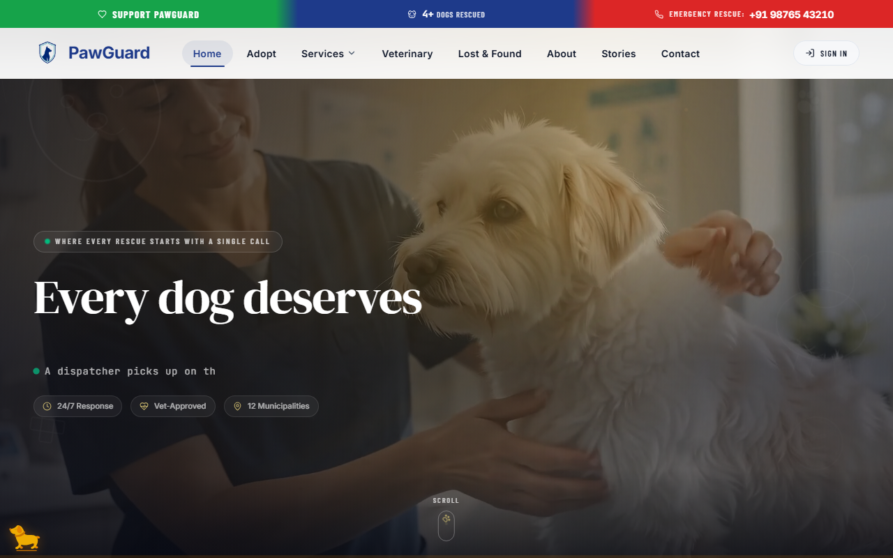

*Figure 1.1 — PawGuard Public Web Homepage and Navigation.*

**Key Homepage Elements:**
- **Top Announcement Bar:** Displays active lost pet broadcasts and urgent community alerts.
- **Hero Banner:** Features high-priority action buttons for pet adoption, lost pet reporting, and emergency SOS requests.
- **Impact Metrics:** Shows real-time platform statistics including total rescues, successful adoptions, and active foster pets.
- **Featured Companion Pets:** Highlights animals currently awaiting adoption or foster placement.

### 1.4 Main Navigation
The top navigation bar provides quick access to all major sections of the web application.

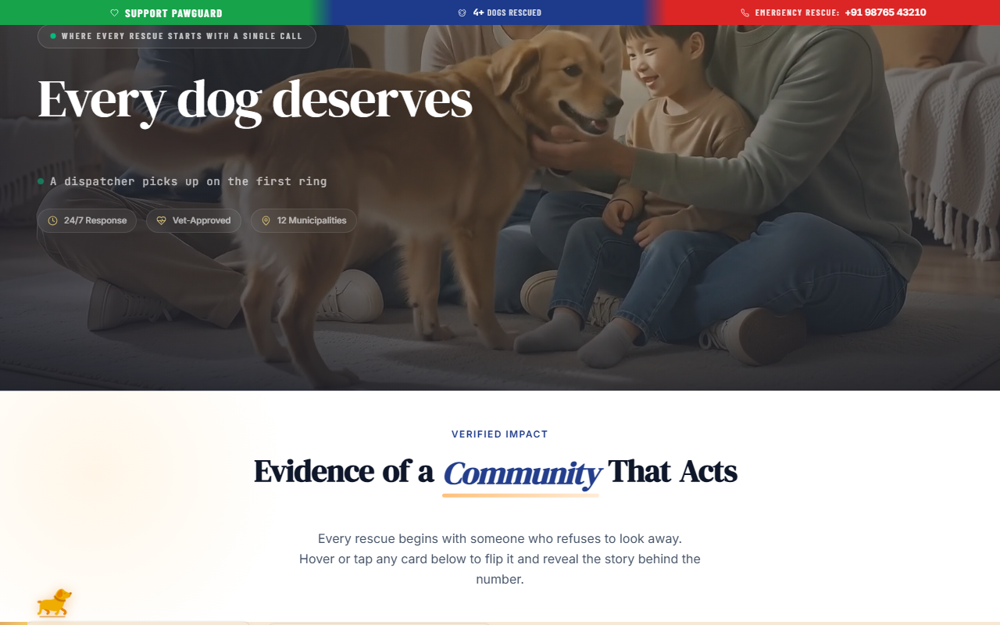

*Figure 1.2 — Main Navigation and Public Web Sections.*

**How to navigate PawGuard:**
1. **Adoption:** Select **Adopt** to view available shelter pets and filtering options.
2. **Lost & Found:** Select **Lost & Found** to view community missing pet feeds or lodge a report.
3. **Emergency:** Select the highlighted **Emergency SOS** button for immediate rescue assistance.
4. **Services & Community:** Use the **Veterinary**, **Volunteer**, **Foster**, **Donate**, and **Education** links to open dedicated service portals.
5. **Account & Auth:** Select **Sign In** or your user avatar to open account settings and applications.

### 1.5 Emergency Access
In critical situations involving injured or trapped animals, click the prominent **Emergency SOS** button located in the top navigation bar or homepage banner to open the immediate rescue form without needing prior registration.

### 1.6 Using PawGuard on Desktop and Mobile Browsers
PawGuard Public Web is fully responsive and optimized for modern web browsers on desktop computers, laptops, tablets, and smartphones. No app installation is required.

> [!TIP]
> Bookmark the PawGuard Public Web application on your smartphone home screen for instant 1-tap access to QR safety tag scanning and emergency rescue requests.

---

## Chapter 2 — Account Registration & Authentication

### 2.1 Creating a PawGuard Account
Creating a free account unlocks personal features such as managing companion pets, registering QR safety tags, tracking adoption applications, and saving medical reminders.

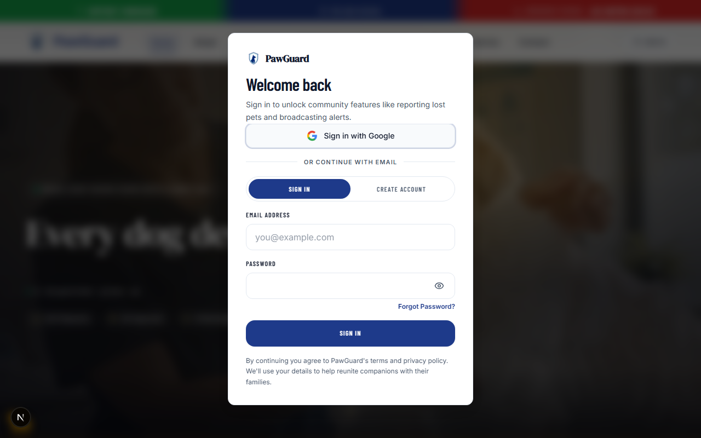

*Figure 2.2 — New User Registration.*

**How to create an account:**
1. Select **Sign In** in the top navigation bar.
2. In the modal, select **Create your account** (or **Sign Up**).
3. Enter your **Full Name**, valid **Email Address**, **Phone Number**, and a strong **Password**.
4. Select **Create account**.

**Expected result:** Your account is created, you are automatically signed in, and your user dashboard opens.

### 2.2 Signing In
Registered users can sign in using their registered email and password credentials.

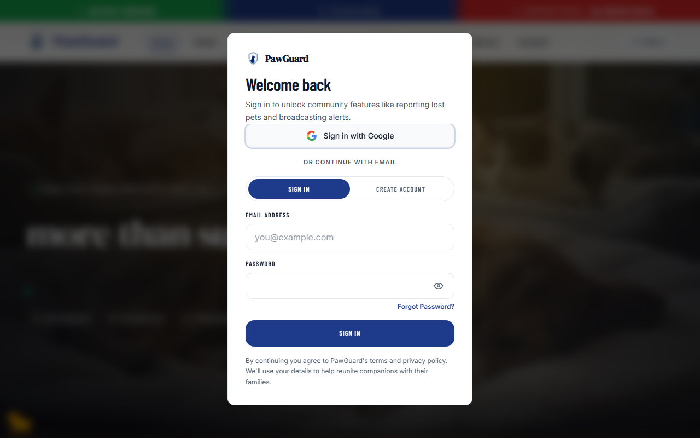

*Figure 2.1 — User Authentication Interface.*

**How to sign in:**
1. Select **Sign In** in the top navigation bar.
2. Enter your registered **Email Address** and **Password**.
3. Select **Sign in**.

**Expected result:** The interface updates to display your avatar and personalized menu options.

### 2.3 Sign In with Google
You can sign in or register instantly using your existing Google Account.

**How to use Google Sign-In:**
1. Open the **Sign In** modal.
2. Select **Continue with Google**.
3. Choose your Google account in the popup window and grant basic profile permissions.

**Expected result:** PawGuard authenticates your Google account and redirects you back to your active page.

### 2.4 Forgot Password
If you forget your password, you can request a secure reset link sent directly to your registered email address.

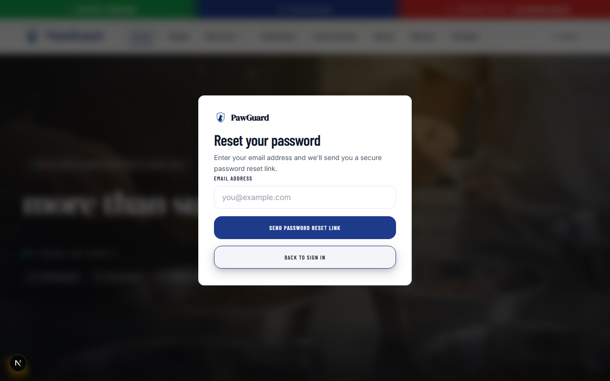

*Figure 2.3 — Password Recovery.*

**How to request a password reset:**
1. Open the **Sign In** modal.
2. Select **Forgot Password?**.
3. Enter your registered **Email Address** and select **Send Reset Link**.

**Expected result:** A confirmation message appears advising you to check your email inbox for password recovery instructions.

### 2.5 Password Reset
1. Open the reset link received in your email.
2. Enter your new password in both password fields.
3. Select **Update Password** to complete the reset.

### 2.6 Signing Out
To sign out on a shared computer, select your profile avatar in the top right header and select **Sign Out**.

### 2.7 Managing Basic Account Information
Account details such as your phone number, avatar, and emergency contact details can be updated at any time under **Account Settings**.

---

## Chapter 3 — Pet Adoption & Foster-to-Adopt

### 3.1 Browsing Available Companion Pets
The Adoption Gallery displays rescue animals currently seeking permanent or foster-to-adopt homes.

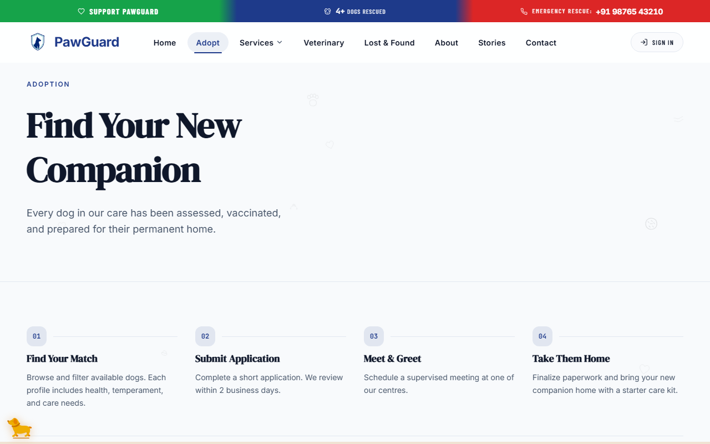

*Figure 3.1 — Pet Adoption Search and Filter Interface.*

### 3.2 Searching for a Pet
Use the search bar at the top of the adoption page to search for animals by name, breed, location, or shelter keyword.

### 3.3 Using Adoption Filters
Narrow down available animals using the filter sidebar:
- **Species:** Filter by Dog, Cat, or other rescue animals.
- **Age:** Filter by Puppy/Kitten, Young, Adult, or Senior.
- **Gender:** Filter by Male or Female.
- **Size:** Filter by Small, Medium, or Large.
- **Special Needs:** Display pets requiring dedicated medical or behavioral care.

### 3.4 Opening a Pet Profile
Select any pet card to view their full profile, photographic gallery, background story, and health history.

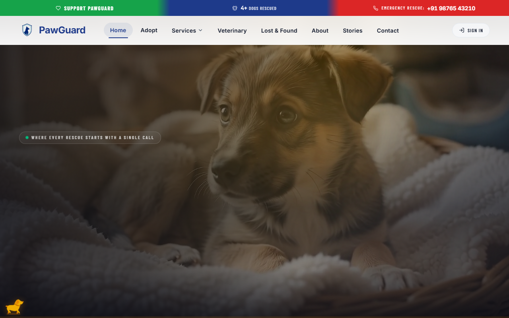

*Figure 3.2 — Companion Pet Profile and Adoption Options.*

### 3.5 Reviewing Pet Information
Each profile includes essential adoption details:
- **Personality Traits:** Activity level, temperament, and compatibility with children or other pets.
- **Medical Overview:** Vaccination status, spay/neuter status, microchip verification, and ongoing health needs.
- **Shelter/Location:** Current rescue facility or active foster family location.

### 3.6 Applying to Adopt
When you find a companion pet you wish to welcome into your home, select **Apply to Adopt**.

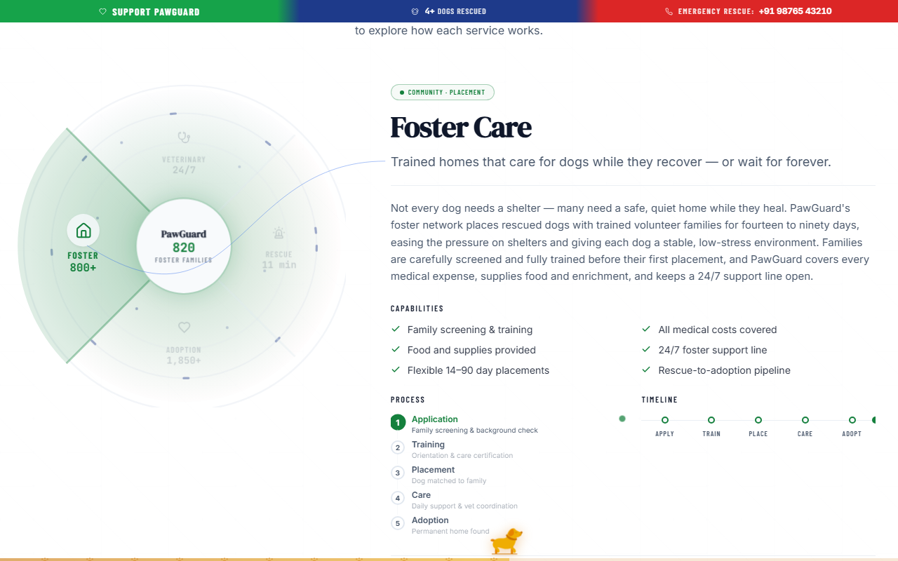

*Figure 3.3 — Adoption Application Form.*

### 3.7 Foster-to-Adopt
If you prefer to care for a pet temporarily before committing to full adoption, select **Foster-to-Adopt** on the pet profile page. This allows you to experience daily life with the companion pet while receiving shelter guidance and support.

### 3.8 Submitting an Adoption Application
**How to submit an Adoption Application:**
1. On the pet detail profile page, select **Apply to Adopt** (or **Foster-to-Adopt**).
2. Complete the digital questionnaire covering your home environment, pet ownership experience, household members, and yard fencing.
3. Review your contact information and select **Submit Application**.

**Expected result:** Your application is registered, and a confirmation modal displays your reference ID. You can monitor progress under **My Applications**.

### 3.9 Checking Application Status
Navigate to **Account -> My Applications** to view submitted adoption applications and their status (*Under Review*, *Approved*, *Home Visit Scheduled*, or *Completed*).

---

## Chapter 4 — Lost & Found Pet Network

### 4.1 Viewing the Lost & Found Feed
The Lost & Found network helps reunite missing animals with their families through public broadcasts and interactive map pins.

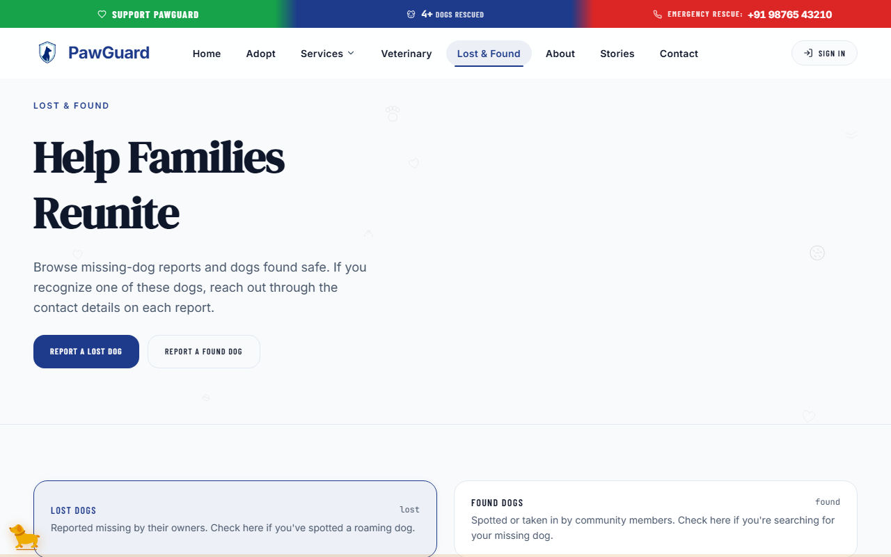

*Figure 4.1 — Lost & Found Feed and Location View.*

### 4.2 Searching for a Lost or Found Pet
Search active notices by pet breed, color, collar description, microchip ID, or city neighborhood.

### 4.3 Filtering Results
Toggle between **Lost Pets** (missing from home) and **Found Pets** (spotted or rescued strays awaiting their owners).

### 4.4 Viewing a Report
Select any notice to inspect high-resolution photographs, last-seen date and time, detailed markings, and map pin coordinates.

### 4.5 Reporting a Lost Pet
If your companion pet goes missing, broadcast an alert immediately across the PawGuard network.

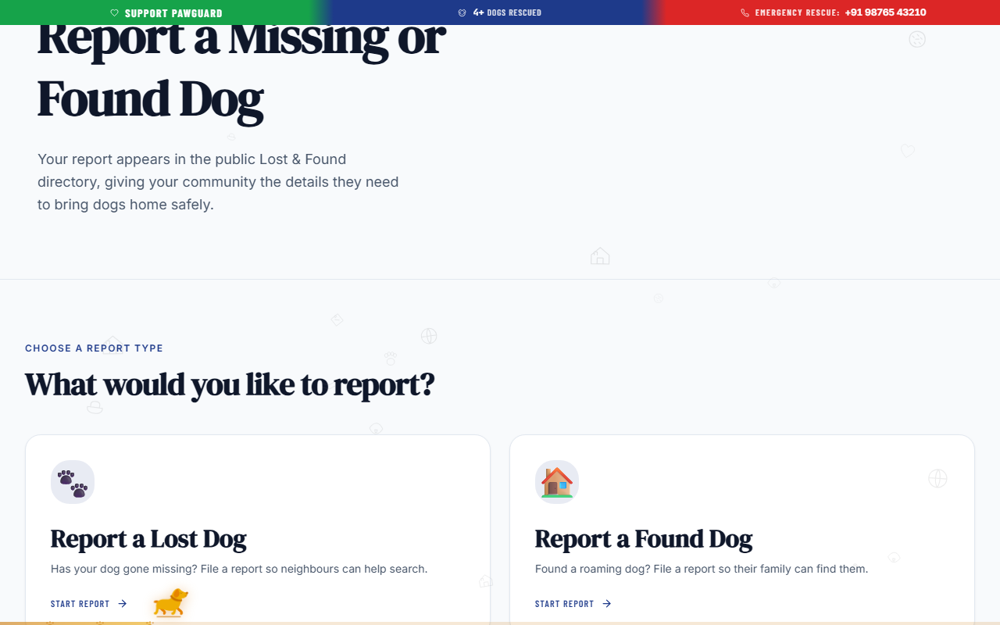

*Figure 4.2 — Lost or Found Pet Report Form.*

**How to report a lost pet:**
1. Navigate to **Lost & Found** and select **Report a Pet**.
2. Select **I Lost a Pet**.
3. Upload clear photographs of your companion pet.
4. Enter pet name, species, breed, primary color, collar details, and microchip number if known.
5. Select the last-seen date, time, and precise pin location on the map.
6. Enter contact phone numbers and select **Submit Report**.

**Expected result:** The report is instantly published on the public feed and added to the interactive lost pet map.

### 4.6 Reporting a Found Pet
If you find a stray animal or temporary shelter a missing pet:
1. Select **Report a Pet** and choose **I Found a Pet**.
2. Upload clear photos of the animal.
3. Mark the exact location where the animal was found and describe its current safe condition.
4. Submit the report so the owner can identify and claim their companion pet.

### 4.7 Adding Photos and Location
Clear images and accurate map markers significantly increase reunification success. Use the location picker to drag the pin to the exact street or landmark.

### 4.8 Submitting a Community Sighting
If you spot an animal matching a lost pet report but cannot capture it, submit a quick sighting report.

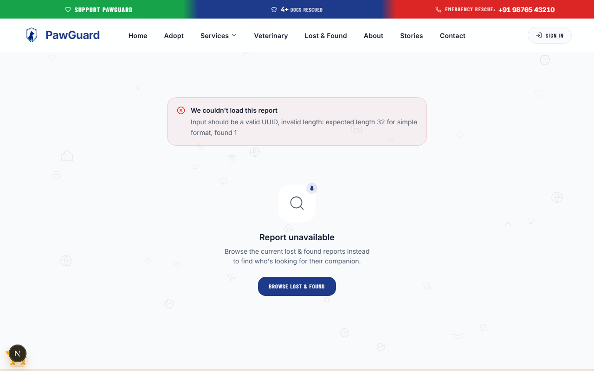

*Figure 4.3 — Community Sighting Report.*

**How to submit a sighting:**
1. Open the relevant lost pet notice.
2. Select **Report Sighting**.
3. Specify the date, time, direction of movement, and attach a photo if taken.
4. Select **Submit Sighting**.

**Expected result:** A notification is dispatched to the pet owner containing your sighting location and details.

### 4.9 Contacting the Relevant Person
Use the verified contact buttons on the report page to call or send a secure message directly to the pet owner or finder.

---

## Chapter 5 — Emergency Rescue Assistance

### 5.1 When to Use Emergency Rescue
Use the **Emergency Rescue Request** feature when you encounter an animal in critical distress, such as:
- Severely injured or hit-by-vehicle animals requiring urgent transport.
- Animals trapped in drains, wells, or hazardous structures.
- Abandoned animals experiencing extreme physical distress or heat exhaustion.
- Situations posing immediate danger to animal life.

> [!IMPORTANT]
> Emergency Rescue is reserved for urgent animal distress. For non-urgent stray reports or general inquiries, please use the standard Lost & Found or Contact support channels.

### 5.2 Opening the Emergency Rescue Request
Select the red **Emergency SOS** button located prominently in the top header or visit `/emergency`.

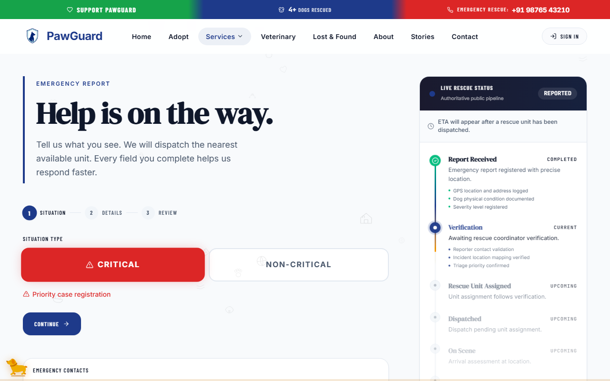

*Figure 5.1 — Emergency Rescue Request Interface.*

### 5.3 Selecting Incident/Urgency Information
Select the appropriate urgency tier:
- **Critical / Life-Threatening:** Immediate vehicle injuries, severe bleeding, or active physical danger.
- **High Urgency:** Trapped animals, severe sickness, or vulnerable stranded young puppies/kittens.
- **Moderate Rescue:** Injured stray requiring non-immediate medical evaluation.

### 5.4 Sharing Location
Select **Use Current Location** to automatically capture your smartphone GPS coordinates, or manually pinpoint the rescue scene on the map.

### 5.5 Adding Supporting Information
- Attach a photo or short video of the animal's condition.
- Provide nearby landmarks, gate numbers, or access notes for the rescue team.
- Enter your callback phone number so responders can contact you on arrival.

### 5.6 Submitting the Emergency Rescue Request
Review the entered emergency details and select **Dispatch Emergency Rescue**.

### 5.7 What Happens After Submission
Upon submission, an instant high-priority alert is broadcast to nearby rescue team members and partner veterinary responders. An on-screen confirmation banner confirms your emergency request ID and hotline callback details.

---

## Chapter 6 — QR Safety Tags & Scanner

### 6.1 What Is a QR Safety Tag?
A PawGuard QR Safety Tag is a physical collar tag featuring a unique QR code. When anyone scans the tag using a smartphone camera, they can instantly view public contact and medical information to return your lost companion pet safely.

### 6.2 Scanning a QR Safety Tag
If you find a lost animal wearing a PawGuard QR tag, open your smartphone camera app or browser and scan the QR code. You will be directed to the tag's public safety page.

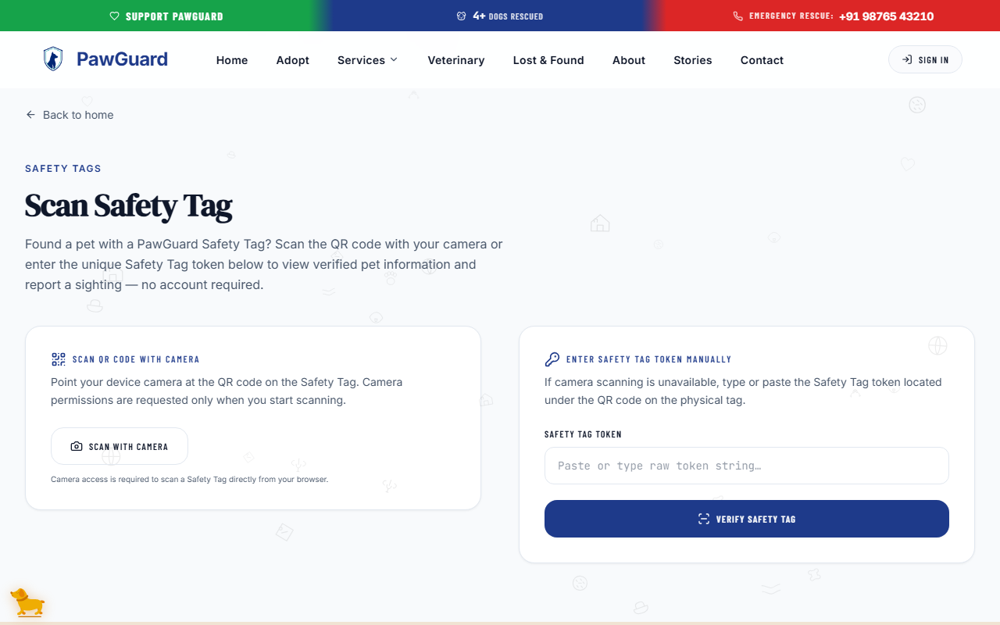

*Figure 6.1 — QR Safety Tag Finder View.*

### 6.3 Viewing the Public Pet Information
The public scanner page displays:
- **Companion Pet Name & Photograph**
- **Critical Medical Alerts:** Allergies, required medications, or behavioral notes.
- **Owner Contact Options:** Direct phone call button and messaging action.

### 6.4 Contacting the Pet Owner
Select **Call Owner** or **Send Message** on the finder page to establish direct communication with the pet owner.

### 6.5 Sharing Finder Location
Select **Send GPS Location to Owner** on the scanner page. With your permission, your current smartphone location is sent directly to the owner via instant notification.

### 6.6 Registering a QR Safety Tag
Pet owners can link physical QR safety tags to their registered companion pets in seconds.

*Figure 6.2 — Registering a QR Safety Tag.*

**How to register a QR Safety Tag:**
1. Sign in to your account and navigate to **Account -> My Pets**.
2. Select **Register QR Safety Tag**.
3. Enter the 8-digit serial code printed on the physical tag (or scan the tag with your phone).
4. Select the companion pet profile to associate with the tag.
5. Select **Link Tag to Companion Pet**.

**Expected result:** The tag is activated and linked. Scanning the physical tag will now display your companion pet's public profile and contact options.

### 6.7 Managing a Registered Tag
Under **Account -> My Pets**, you can update displayed phone numbers, toggle private address visibility, or transfer/deactivate a tag if needed.

---

## Chapter 7 — Companion Pets & Health Management

### 7.1 Adding a Companion Pet
Keep all your pets' health records organized by creating companion pet profiles under your account.

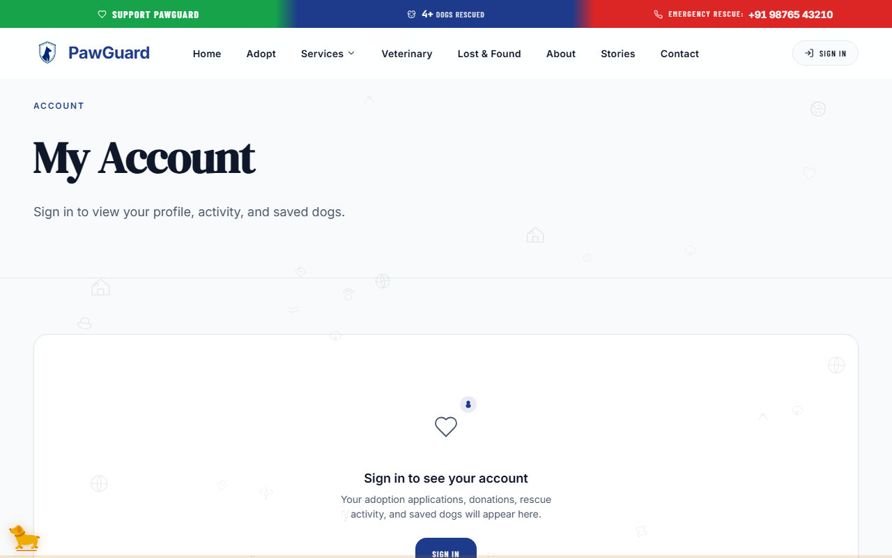

*Figure 7.1 — Managing Companion Pets.*

**How to add a companion pet:**
1. Go to **Account** and select **Add Companion Pet**.
2. Enter pet name, species, breed, birth date / age, gender, microchip number, and upload a profile photo.
3. Select **Save Pet Profile**.

**Expected result:** The pet profile is created and listed under your active companion pets roster.

### 7.2 Viewing Companion Pets
Select any pet card under **My Pets** to view health history, registered QR safety tags, and scheduled care reminders.

### 7.3 Updating Pet Information
Update pet weight, dietary preferences, spay/neuter verification, or owner address at any time by selecting **Edit Profile**.

### 7.4 Managing Medical Records
Store vaccination dates, medical conditions, prescription dosages, and veterinary reports safely online.

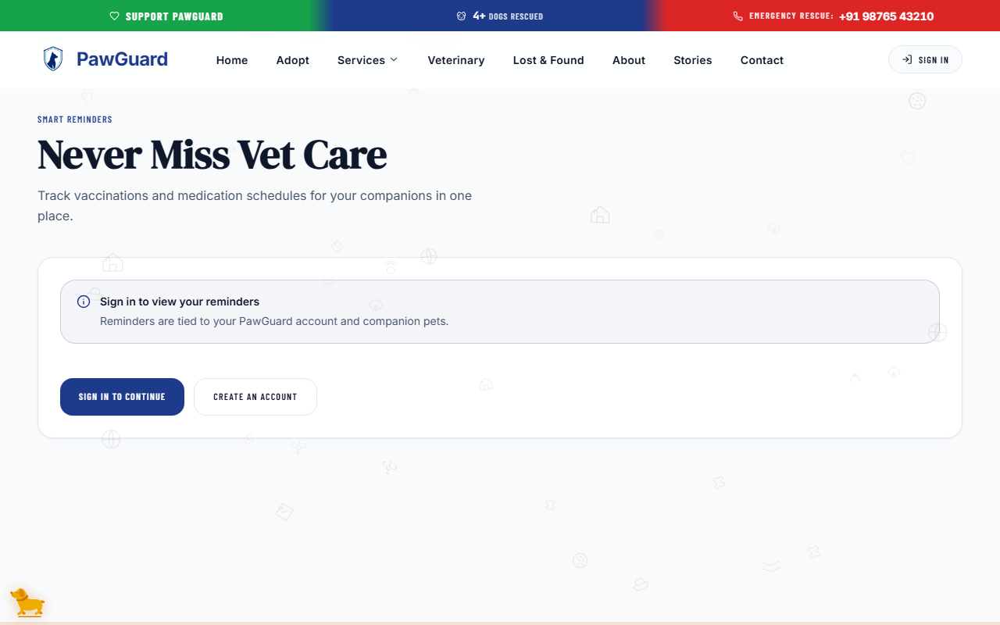

*Figure 7.2 — Companion Pet Health and Medical Records.*

### 7.5 Vaccination Information
Track essential immunizations (Rabies, DHPP, FVRCP) with date administered, expiration date, and veterinarian verification notes.

### 7.6 Health Reminders
PawGuard automatically generates health notifications for upcoming booster shots, deworming schedules, flea/tick treatments, and routine wellness checkups.

### 7.7 Completing or Snoozing Reminders
Under **Reminders**, select **Mark Complete** when a vaccination or treatment is administered, or select **Snooze** to defer the notification by 7 days.

---

## Chapter 8 — Veterinary Clinics & Appointment Booking

### 8.1 Finding a Veterinary Clinic
The Veterinary Directory helps you locate verified animal hospitals, emergency clinics, and specialist practitioners in your city.

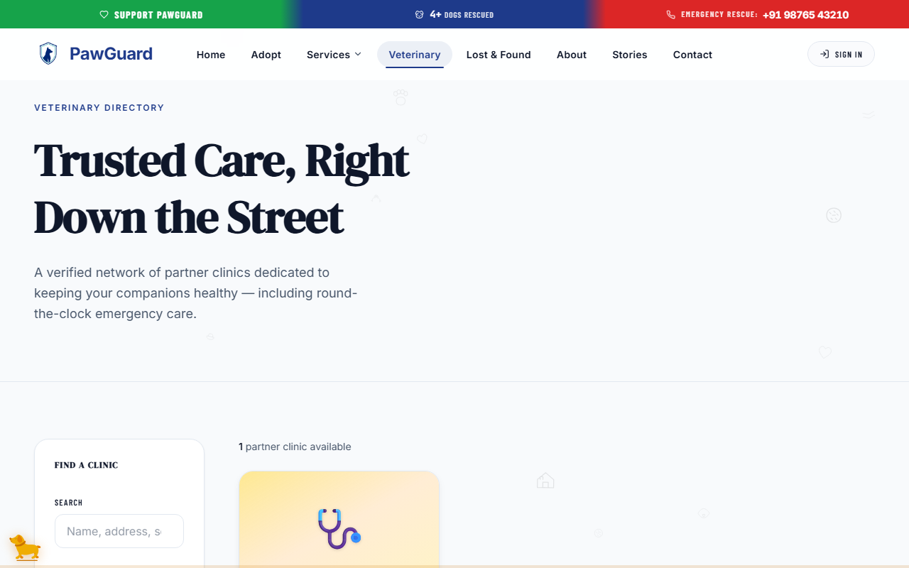

*Figure 8.1 — Veterinary Clinic Directory.*

### 8.2 Searching Clinics
Search by clinic name, doctor surname, city district, or zip code.

### 8.3 Using Service/Emergency Filters
Filter clinic listings by specialized offerings:
- **24/7 Emergency Care:** Clinics offering round-the-clock emergency surgical care.
- **Vaccination & Wellness:** Routine health screenings and preventive care.
- **Surgeries & Diagnostics:** X-ray, ultrasound, blood testing, and surgical suites.
- **Grooming & Dental:** Dental scaling and pet hygiene services.

### 8.4 Viewing Clinic Information
Clinic cards display consultation fees, operating hours, emergency contact numbers, staff veterinarians, and physical street addresses.

### 8.5 Booking an Appointment
Schedule veterinary visits online without needing to make phone calls.

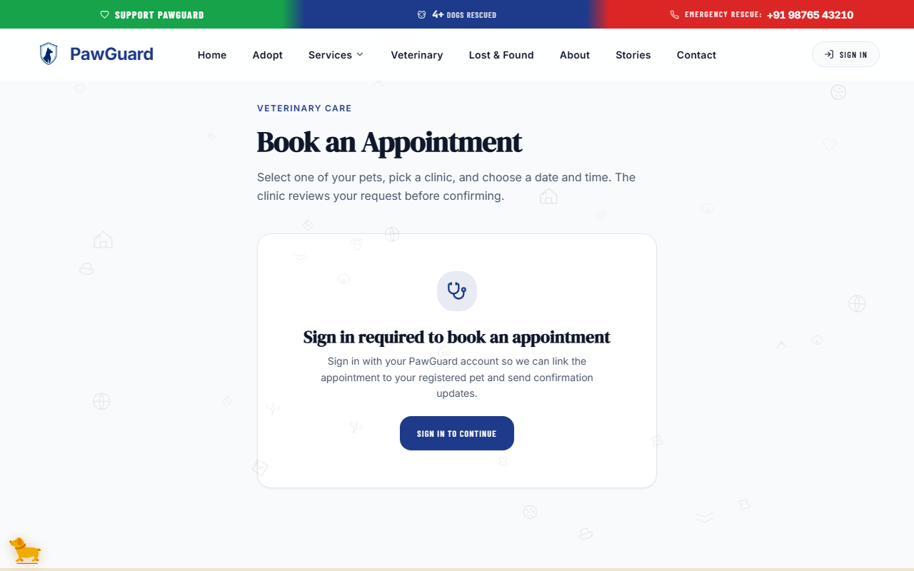

*Figure 8.2 — Veterinary Appointment Booking.*

**How to book an appointment:**
1. Navigate to **Veterinary** or select **Book Appointment**.
2. Select your preferred clinic and attending veterinarian.
3. Choose an available calendar date and time slot.
4. Select the registered **Companion Pet** attending the visit.
5. Enter the consultation reason (e.g., Annual Rabies Booster, Skin Allergy Check).
6. Select **Confirm Booking**.

**Expected result:** Your appointment is scheduled, and a digital booking confirmation is saved under your account health calendar.

### 8.6 Selecting a Veterinarian
Choose a specific doctor or select *First Available Practitioner* for faster booking.

### 8.7 Selecting Date and Time
Available consultation time slots are displayed in real-time. Grayed-out slots indicate fully booked hours.

### 8.8 Selecting a Companion Pet
Choose from your registered companion pets so the clinic receives your pet's medical background prior to the visit.

### 8.9 Providing the Appointment Reason
Adding detailed symptoms or service requests helps the veterinary clinic prepare necessary diagnostics in advance.

### 8.10 Confirming the Appointment
Review the clinic location, selected doctor, appointment fee, and scheduled time before selecting **Confirm Booking**.

### 8.11 Viewing Appointment/Reminder Information
View all upcoming and past veterinary visits under **Account -> Appointments & Reminders**.

---

## Chapter 9 — Volunteer Hub & Portal

### 9.1 About Volunteering
PawGuard relies on passionate community volunteers for shelter pet care, adoption event organizing, rescue transport, community outreach, and foster support.

### 9.2 Submitting a Volunteer Application
Join the PawGuard volunteer network by completing a digital volunteer application.

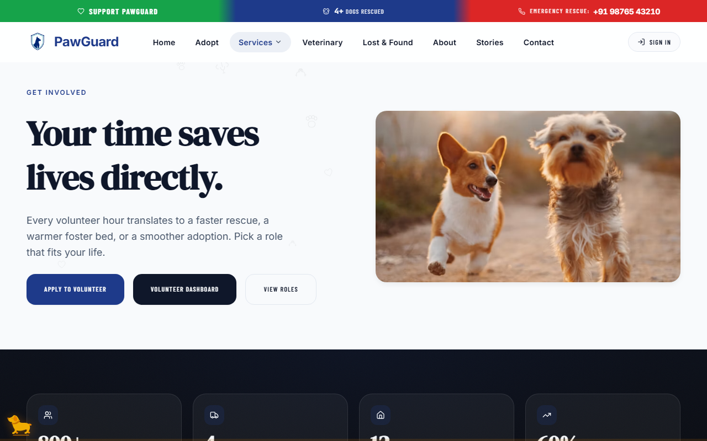

*Figure 9.1 — Volunteer Application.*

**How to apply as a volunteer:**
1. Navigate to **Volunteer** and select **Apply to Volunteer**.
2. Fill out personal contact details, occupation, and weekly availability.
3. Select your areas of interest (e.g., Event Coordination, Animal Handling, Transport, Photography, Public Awareness).
4. Describe prior animal experience and select **Submit Application**.

**Expected result:** Your application is submitted for coordinator review. You can track status under **My Applications**.

### 9.3 Selecting Role Preferences
Choose roles that align with your skills and schedule:
- **Shelter Pet Care:** Dog walking, grooming, socialization, and feeding.
- **Event Operations:** Assisting at weekend adoption pop-ups and awareness drives.
- **Rescue Transport:** Driving rescued animals to veterinary clinics or foster homes.
- **Media & Storytelling:** Capturing photos and writing adoption bios.

### 9.4 Accessing the Volunteer Portal
Once approved, select **Volunteer Portal** under your profile menu to open your dedicated volunteer dashboard.

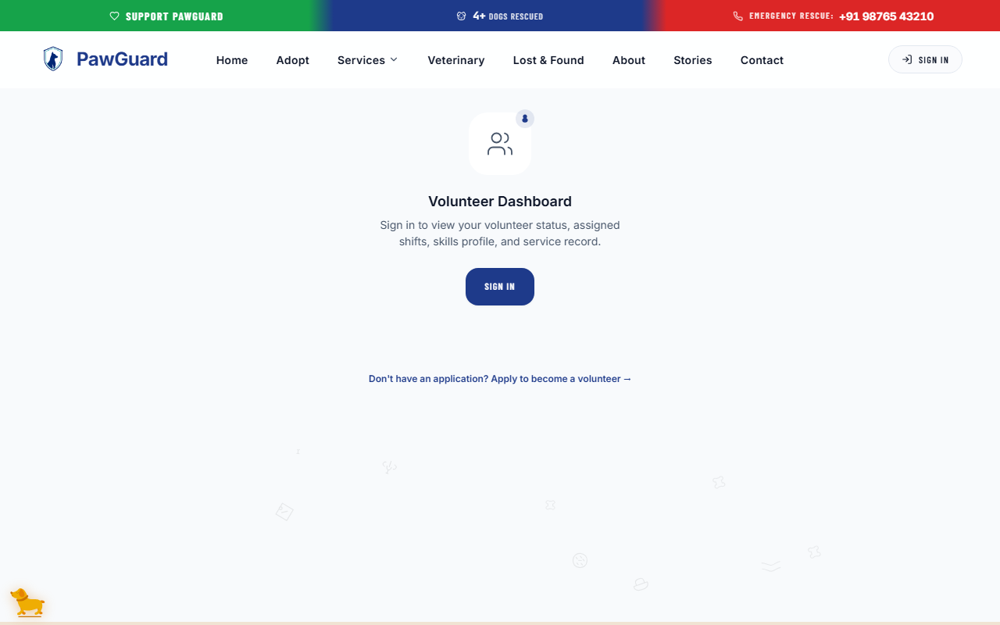

*Figure 9.2 — Volunteer Portal Dashboard.*

### 9.5 Viewing Assigned Tasks
The portal dashboard displays your upcoming volunteer assignments, team messages, and shift times.

### 9.6 Viewing Events
Browse upcoming adoption drives and community awareness campaigns, and sign up for open volunteer shifts.

### 9.7 Managing Volunteer Activities
Update your active availability status or request role changes directly inside the volunteer portal.

### 9.8 Recording Volunteer Hours
Log completed shift hours after attending events to track your service contributions and earn community recognition certificates.

---

## Chapter 10 — Foster Care Program & Portal

### 10.1 About Foster Care
Foster Families provide temporary loving homes for rescue animals recovering from medical procedures, young orphaned litters, or pets awaiting permanent adoption placement.

### 10.2 Applying to Become a Foster Family
Prospective foster parents can submit a foster application detailing their living arrangements and pet experience.

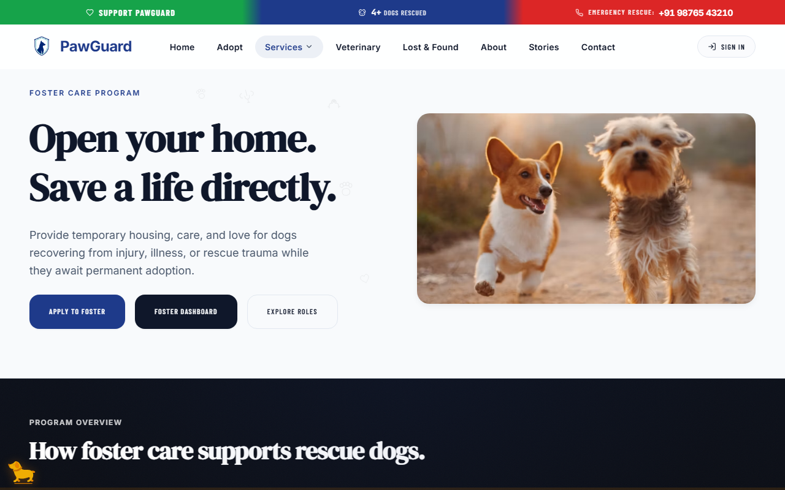

*Figure 10.1 — Foster Family Application.*

**How to apply as a Foster Family:**
1. Navigate to **Foster** and select **Apply for Foster Care**.
2. Provide home details (house vs. apartment, landlord approval, yard fencing).
3. Select preferred foster animal types (Puppies/Kittens, Adult Dogs, Medical Recovery, Senior Pets).
4. Enter household member and existing pet information.
5. Select **Submit Foster Application**.

**Expected result:** Your application is logged and assigned to a foster coordinator.

### 10.3 Providing Availability Preferences
Indicate whether you can accommodate short-term emergency fostering (1-2 weeks), long-term fostering (1-3 months), or specialized medical recovery care.

### 10.4 Accessing the Foster Portal
Approved foster families gain access to the dedicated **Foster Portal** dashboard.

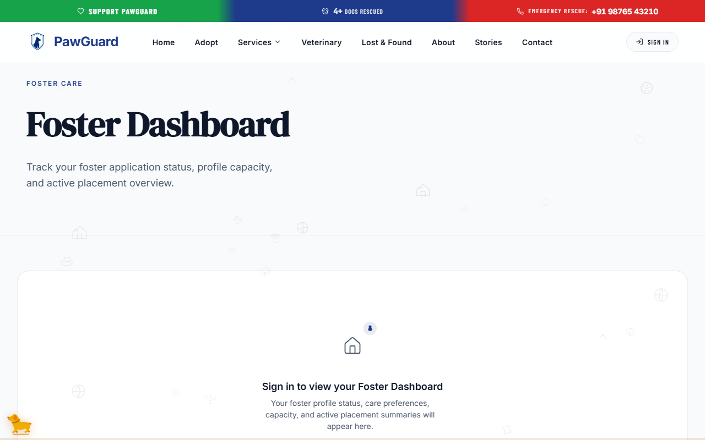

*Figure 10.2 — Foster Care Dashboard.*

### 10.5 Viewing Assigned Companion Pets
The Foster Dashboard displays profiles, medical requirements, diet plans, and adoption inquiry statuses for animals currently in your foster care.

### 10.6 Recording Daily Care
Log daily weight checks, appetite notes, medication doses, and behavioral progress so rescue coordinators can monitor pet well-being.

### 10.7 Requesting Food or Supplies
Use the **Request Supplies** form in the portal to request food, crates, puppy pads, or veterinary care appointments for your foster companion pet.

---

## Chapter 11 — Donations & Community Support

### 11.1 Supporting PawGuard
Your contributions directly fund emergency animal rescues, medical surgeries, shelter feeding programs, spay/neuter drives, and QR safety tag distributions.

### 11.2 One-Time Donations
Make a secure single contribution using credit cards, debit cards, net banking, or UPI via the integrated payment gateway.

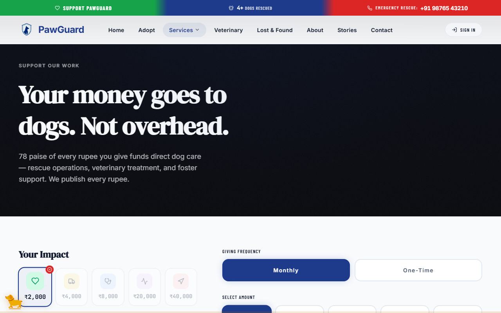

*Figure 11.1 — Monetary Donation Options.*

### 11.3 Recurring Donations
Select **Monthly Giving** to support ongoing shelter operations with an automated monthly contribution that can be cancelled anytime.

### 11.4 Selecting a Donation Amount
Choose from predefined impact tiers:
- **Emergency Medical Kit:** Fund basic first-aid supplies for a rescued stray.
- **Monthly Feeding Care:** Provide nutritious food for a rescue pet for 30 days.
- **Life-Saving Surgery:** Sponsor urgent veterinary surgical care for an injured animal.

### 11.5 Entering a Custom Amount
Select **Custom Amount** and enter any contribution amount of your choice.

### 11.6 Completing a Donation
**How to complete a monetary donation:**
1. Navigate to **Donate**.
2. Select **One-Time** or **Monthly**.
3. Pick a donation tier or enter a custom amount.
4. Select **Proceed to Payment**.
5. Complete payment securely in the payment window.

**Expected result:** Your donation is processed, a tax-deductible receipt is displayed, and a copy is saved under **My Account -> Donations**.

### 11.7 Supplies Wishlist
In addition to monetary gifts, you can fulfill physical item wishlists requested by local shelters.

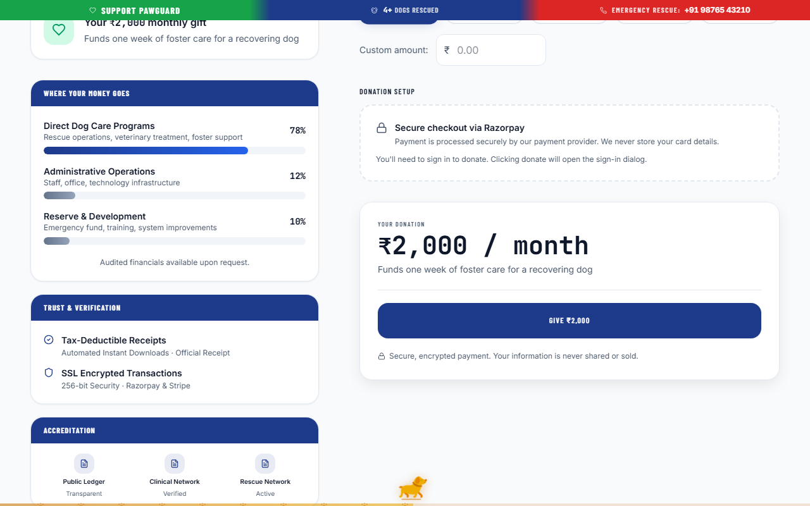

*Figure 11.2 — Supplies Wishlist and Community Support.*

**How to donate supplies:**
1. Scroll to the **Physical Supplies Wishlist** on the Donate page.
2. View items needed (e.g., Dog Food, Blankets, Antiseptic Wash, Leashes, Crates).
3. Select **Donate Items** to order directly or view drop-off shelter addresses.

### 11.8 Community Support Campaigns
View active emergency fundraising campaigns for critical rescue operations and track overall progress bars toward financial targets.

---

## Chapter 12 — Education, Stories & Support

### 12.1 Educational Articles
Access a rich library of expert articles covering pet health, nutrition, behavioral training, disaster preparedness, and animal welfare laws.

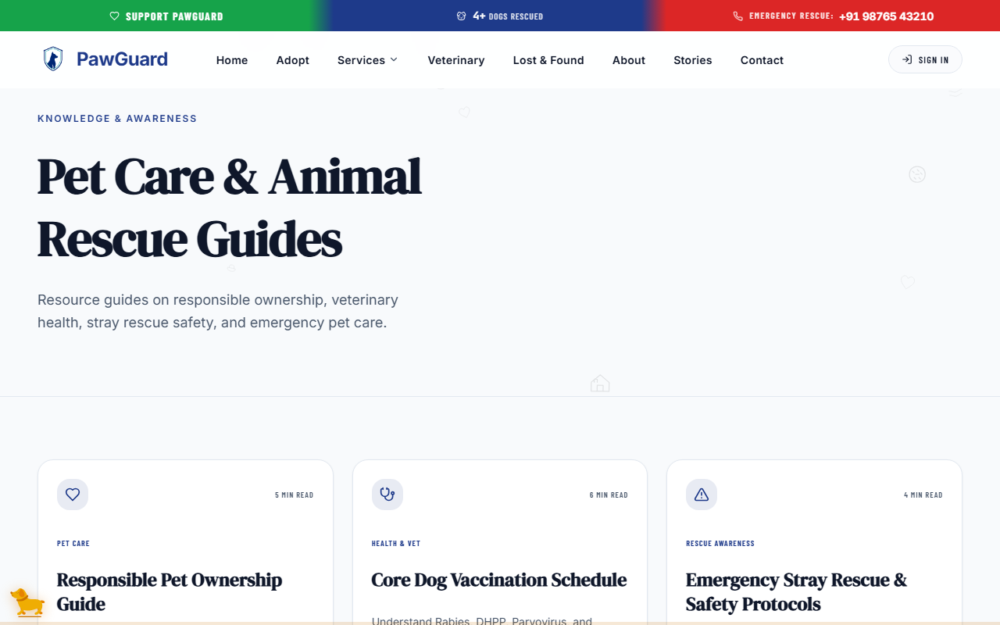

*Figure 12.1 — Pet Care Education and Guides.*

### 12.2 Pet Care Guides
Browse step-by-step care guides for first-time adopters, puppy care, cat behavior, senior pet wellness, and monsoon pet care.

### 12.3 Searching and Filtering Educational Content
Filter articles by categories (*Pet Care*, *Health & Medical*, *Training & Behavior*, *Rescue Stories*, *Safety Tips*) or search using keywords.

### 12.4 Reading an Article
Select any article card to open the complete guide with illustrative diagrams, expert veterinary tips, and printable PDF care checklists.

### 12.5 Success Stories
Read inspiring tales of rescued animals who found loving forever homes through PawGuard.

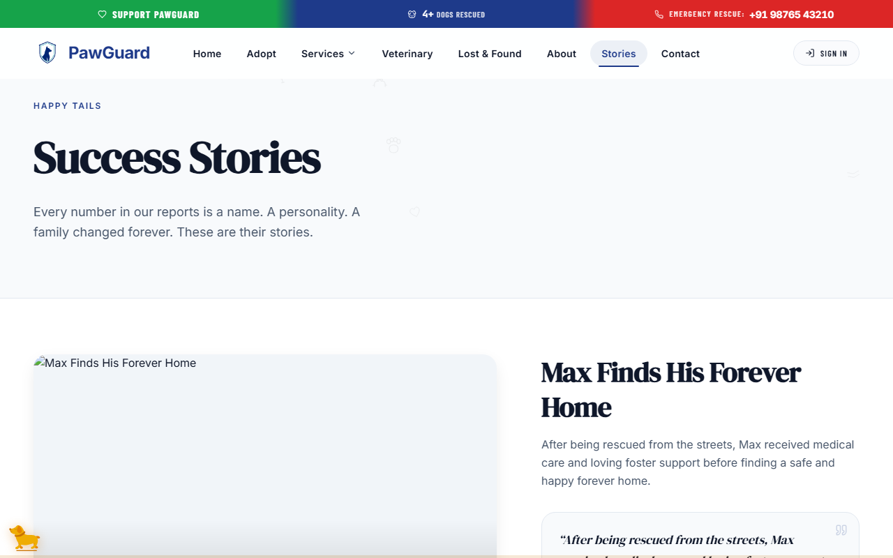

*Figure 12.3 — Rescue and Adoption Success Stories.*

### 12.6 Contacting PawGuard
Reach out to PawGuard support for general inquiries, partnership opportunities, or technical assistance via the **Contact Us** page.

### 12.7 Submitting a Grievance Ticket
If you experience service issues, report animal cruelty, or have platform concerns, submit a confidential grievance ticket.

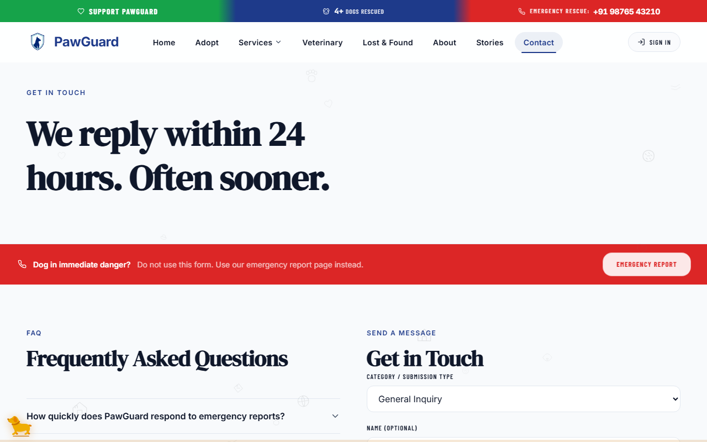

*Figure 12.2 — Support and Grievance Submission.*

**How to submit a Grievance Ticket:**
1. Navigate to **Contact** (or **Support**).
2. Select **Submit Grievance Ticket**.
3. Choose the issue category (*Cruelty Report*, *Application Concern*, *Platform Bug*, *General Grievance*).
4. Enter a subject title and detailed description.
5. Attach supporting images if available and select **Submit Ticket**.

**Expected result:** Your ticket is generated with a tracking reference number for support follow-up.

### 12.8 Providing Support Details
Providing clear dates, exact addresses, and photo attachments ensures rapid response by the support team.

---

## Chapter 13 — User Profile & Account Settings

### 13.1 Opening Your Account
Access your central dashboard by selecting your profile avatar in the top right menu and choosing **Account Settings**.

*Figure 13.1 — User Profile and Account Settings.*

### 13.2 Updating Profile Information
Keep your contact details up to date:
- **Personal Details:** Full name, primary phone number, secondary emergency contact, and physical address.
- **Profile Photo:** Upload or change your personal avatar.
- **Communication Preferences:** Toggle SMS, email, and WhatsApp alert notifications.

### 13.3 Managing Companion Pets
Add new pets, update medical profiles, print QR code safety tag sheets, or edit health logs under **Account -> My Pets**.

### 13.4 Managing QR Safety Tags
View all registered QR safety tags, update emergency contact phone numbers linked to each tag, or mark a tag as lost/replaced.

### 13.5 Reviewing Applications
Track all active digital applications submitted across the platform.

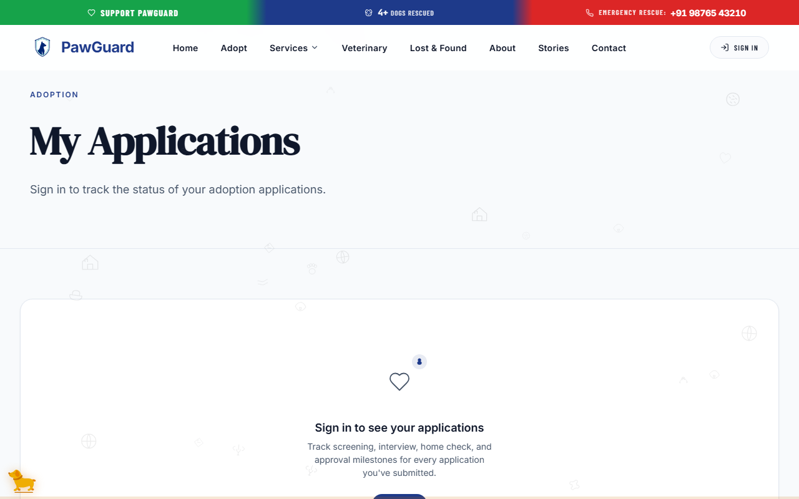

*Figure 13.2 — Application Status Tracking.*

### 13.6 Understanding Application Status
Application statuses are color-coded for clarity:
- **Pending Review (Yellow):** Application received and awaiting initial coordinator screening.
- **Under Review (Blue):** Application actively undergoing background or questionnaire check.
- **Approved (Green):** Application approved! Next steps (e.g., home visit or shelter meet-and-greet) dispatched.
- **Completed (Dark Green):** Adoption, volunteer placement, or foster onboarding finalized.
- **Closed / Declined (Gray):** Application closed or not selected for the current pet.

### 13.7 Account Security Options
Change your account password securely by entering your current password followed by your new password. You can also review active session history.

### 13.8 Signing Out
Select **Sign Out** from the account dropdown to safely end your web session.

---

## Chapter 14 — Frequently Asked Questions & Troubleshooting

### 14.1 I cannot sign in
- **Check Credentials:** Ensure your email address is spelled correctly without extra trailing spaces.
- **Password Case Sensitivity:** Verify caps lock is turned off when entering your password.
- **Use Reset Link:** If credentials fail, select **Forgot Password?** to set a new password via email.

### 14.2 I forgot my password
Open the Sign In window, select **Forgot Password?**, enter your registered email, and check your inbox (and spam folder) for the password recovery link.

### 14.3 I cannot find the pet I am searching for
Try widening your search filters. Select *All Breeds* or expand your location radius. The companion pet may have been recently adopted or placed in a foster home.

### 14.4 My adoption search shows no results
If your filter combination yields no matching animals, a clear notification banner is displayed.

*Figure 14.1 — Example User-Facing Error or Validation Message.*

**How to resolve empty search results:**
1. Select **Clear All Filters** on the search sidebar.
2. Search by species alone (e.g., *Dog*) before applying age or size filters.

### 14.5 I cannot submit a form
- **Required Fields:** Ensure all fields highlighted with a red outline are filled.
- **Phone Number Format:** Enter valid 10-digit phone numbers without special symbols.
- **Email Validation:** Confirm your email follows standard format (`name@example.com`).

### 14.6 Location permission is not working
When submitting an Emergency SOS or Lost Pet report, your web browser requests permission to access location:
1. When prompted by your browser, select **Allow Location Access**.
2. If blocked previously, tap the lock/tune icon next to the browser URL bar, select **Permissions**, and set **Location** to **Allow**.

### 14.7 I cannot upload a photo
- **Supported Formats:** Ensure images are in standard PNG, JPG, JPEG, or WEBP format.
- **File Size:** Upload photos smaller than 10 MB per file.

### 14.8 A QR Safety Tag cannot be found
Verify the 8-digit serial code entered matches the physical tag exactly. If scanning a physical tag, clean the tag surface and ensure adequate lighting.

### 14.9 A page is not loading
Refresh your browser page (`Ctrl + R` or `Cmd + R`). Confirm your internet or Wi-Fi connection is active.

### 14.10 What should I do if something goes wrong?
If you encounter persistent issues, navigate to **Contact Us** and submit a support ticket describing the problem. Our team will assist you promptly.

---

## Quick User Workflows

### Workflow 1: Browse & Apply for Pet Adoption
- **Starting Point:** Homepage -> Select **Adopt**.
- **Steps:**
  1. Filter by species, age, and size on the adoption gallery.
  2. Select a pet card to inspect their profile and health history.
  3. Select **Apply to Adopt**.
  4. Complete the home questionnaire and submit.
- **Expected Result:** Application logged with reference ID; trackable under **Account -> My Applications**.

### Workflow 2: Report a Lost Pet
- **Starting Point:** Navigation Bar -> Select **Lost & Found** -> **Report a Pet**.
- **Steps:**
  1. Choose **I Lost a Pet**.
  2. Upload clear photos and enter pet traits/microchip details.
  3. Pin last-seen location on the map and enter contact phone.
  4. Select **Submit Report**.
- **Expected Result:** Notice published immediately on the public feed and lost pet map.

### Workflow 3: Report a Found Pet
- **Starting Point:** **Lost & Found** -> **Report a Pet** -> Choose **I Found a Pet**.
- **Steps:** Upload stray photos, set map pin location, describe condition, and submit contact details.
- **Expected Result:** Notice broadcasted so the owner can claim their pet.

### Workflow 4: Submit a Community Sighting
- **Starting Point:** Open any active Lost Pet report.
- **Steps:** Select **Report Sighting**, enter date/time/direction, attach optional photo, and submit.
- **Expected Result:** Instant sighting alert sent directly to the pet owner.

### Workflow 5: Submit an Emergency Rescue Request
- **Starting Point:** Click red **Emergency SOS** in header.
- **Steps:** Select urgency level, tap **Use Current Location**, attach incident photo, add landmarks, and submit.
- **Expected Result:** Immediate alert sent to local rescue team; on-screen confirmation hotline displayed.

### Workflow 6: Scan a QR Safety Tag
- **Starting Point:** Scan tag with phone camera -> Opens `/scan` public page.
- **Steps:** View pet medical alerts -> Select **Call Owner** or **Send GPS Location to Owner**.
- **Expected Result:** Pet owner notified with finder's location and contact message.

### Workflow 7: Register a QR Safety Tag
- **Starting Point:** **Account -> My Pets**.
- **Steps:** Select **Register QR Safety Tag**, enter 8-digit serial code, pick companion pet, and select **Link Tag**.
- **Expected Result:** Tag activated; scanning physical tag displays your pet's public safety profile.

### Workflow 8: Book a Veterinary Appointment
- **Starting Point:** Navigation Bar -> Select **Veterinary** -> **Book Appointment**.
- **Steps:** Pick clinic and doctor, choose date/time slot, select companion pet, enter reason, and confirm.
- **Expected Result:** Booking saved; appointment details added to your account calendar.

### Workflow 9: Apply as a Volunteer
- **Starting Point:** Navigation Bar -> **Volunteer** -> **Apply to Volunteer**.
- **Steps:** Fill personal background, select role preferences, submit application, and await coordinator approval.
- **Expected Result:** Application submitted; access to Volunteer Portal granted upon approval.

### Workflow 10: Apply as a Foster Family
- **Starting Point:** Navigation Bar -> **Foster** -> **Apply for Foster Care**.
- **Steps:** Complete home environment details, select preferred foster animals, and submit.
- **Expected Result:** Application assigned to foster coordinator; access to Foster Care Dashboard enabled upon approval.

### Workflow 11: Make a Donation
- **Starting Point:** Navigation Bar -> Select **Donate**.
- **Steps:** Choose One-Time or Monthly, select tier or enter custom amount, select **Proceed to Payment**, and complete transaction.
- **Expected Result:** Donation processed; digital tax receipt displayed and saved under your account history.

### Workflow 12: Manage a Companion Pet
- **Starting Point:** **Account -> My Pets**.
- **Steps:** Select **Add Companion Pet**, enter health details/photo, save profile, and manage vaccination reminders.
- **Expected Result:** Complete pet medical record stored securely online.

---

## Safety & Privacy Guidance

- **Account Security:** Keep your account password private. PawGuard staff will never ask for your password.
- **Privacy Controls:** Information displayed on public Lost & Found or QR tag scan pages is limited strictly to pet information and selected emergency contact numbers. Your full residential street address is kept secure.
- **Location Sharing:** Share browser location carefully when reporting emergencies or tag scans to ensure accurate rescue response.
- **Trusted Payment Processing:** Enter payment details only within the official PawGuard payment window. PawGuard never stores full card credentials on its servers.

---

## Accessibility & Browser Guidance

- **Browser Compatibility:** PawGuard Public Web is tested and optimized for current versions of Chrome, Safari, Firefox, Edge, and mobile browsers.
- **Responsive Layout:** Automatically adapts to phone, tablet, and desktop screens.
- **Keyboard Navigation:** Forms, modals, and navigation buttons support standard keyboard `Tab` and `Enter` interaction.
- **Screen Reader Support:** Semantic HTML headings, ARIA labels, and image alt text support assistive technology devices.

---
