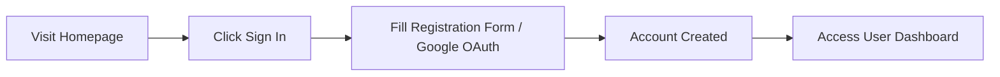
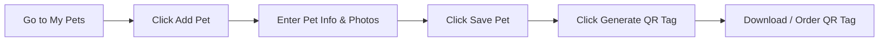
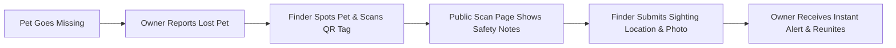
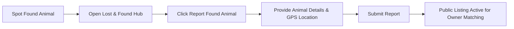
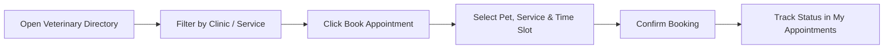
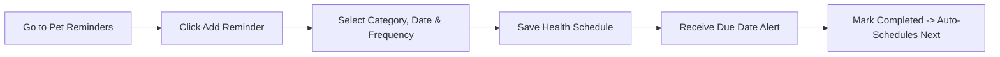
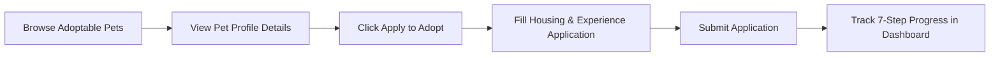
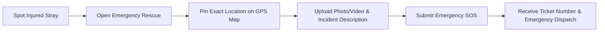
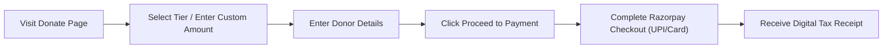
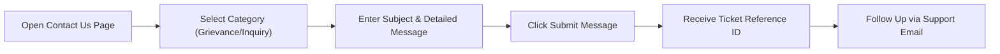

# 18. Complete End-to-End User Journeys

This section provides complete, step-by-step walkthroughs for the 10 major real-world user journeys supported by the PawGuard Public Web application.

---

## Journey 1: New Visitor Registration & Account Setup

1. **Starting Point:** Open `https://pawguard-web-v2.vercel.app`.
2. **User Action:** Click **Sign in** in the top navigation header and select **Sign Up** (or click **Continue with Google**).
3. **Form Entry:** Enter Full Name, Email Address, Phone Number, and Password.
4. **Website Response:** PawGuard verifies details, creates the account, and signs the user in.
5. **End Result:** User is logged in, their name appears in the header, and they can access **My Account** (`/account`).

---

## Journey 2: Registering a Companion Pet & Creating a QR Safety Tag

1. **Starting Point:** Navigate to **My Account** -> **My Pets** (`/account/pets`).
2. **User Action:** Click **Add Pet**.
3. **Form Entry:** Enter Pet Name ("Max"), Species, Breed, Age, Gender, Microchip ID, Emergency Care Notes ("Requires daily eye drops"), and upload a photo.
4. **Website Response:** Pet profile is created under your account.
5. **Next Step:** Click **Generate QR Safety Tag**.
6. **End Result:** Unique QR code is linked to Max's profile, ready for printing or attaching to his collar.

---

## Journey 3: Lost Pet Emergency & Finder QR Scan / Sighting Flow

1. **Pet Missing Event:** Owner's pet strays while outdoors.
2. **Owner Action:** Owner opens `/lost-found`, selects pet, enters last seen location, and submits a **Lost Pet Report**. Pet status becomes "LOST".
3. **Finder Action:** A neighbor spots the pet wearing a PawGuard QR tag and scans it with their phone camera.
4. **Website Response:** The scan page opens, showing the pet's photo, name, and care notes ("Requires daily eye drops"), while keeping owner's phone/address private.
5. **Finder Action:** Finder clicks **Report Sighting**, grants GPS location access, adds a photo, and clicks **Submit**.
6. **End Result:** Owner receives an instant notification with exact map coordinates, locates the pet, and updates status to "REUNITED"!

---

## Journey 4: Reporting a Stray or Found Animal

1. **Starting Point:** A community member finds a roaming dog in a local park.
2. **User Action:** Open `/lost-found` and click **Report Found Pet**.
3. **Form Entry:** Select animal type (Dog), breed/color (Golden Retriever mix), found location (Central Park gate), upload photo, and mention current status ("Secured safely in my garden").
4. **Website Response:** A public Found Animal listing is published.
5. **End Result:** Community members searching the Lost & Found hub can match the listing and contact PawGuard to arrange reunion.

---

## Journey 5: Finding a Vet Clinic & Booking an Appointment

1. **Starting Point:** Open the Veterinary Directory (`/veterinary`).
2. **User Action:** Filter clinics by location ("Indiranagar") and service ("Annual Vaccination"). Select a clinic profile and click **Book Appointment**.
3. **Form Entry:** Choose registered pet ("Max"), service type ("Rabies & Booster Vaccine"), select date & time slot (10:30 AM), and add notes.
4. **Website Response:** Appointment request is confirmed and assigned a booking reference.
5. **End Result:** User views and tracks the scheduled appointment under **My Appointments** (`/appointments`).

---

## Journey 6: Setting & Managing Pet Health Reminders

1. **Starting Point:** Open Pet Reminders (`/reminders`).
2. **User Action:** Click **Add Reminder**.
3. **Form Entry:** Select pet ("Max"), Category ("Deworming"), due date (March 25), and set frequency ("Every 3 Months").
4. **Website Response:** Reminder is added to Max's health schedule.
5. **Due Date Event:** On March 25, an alert badge appears in the user's notification bell.
6. **End Result:** After giving the medication, user clicks **Mark Completed**. PawGuard automatically sets the next due date for June 25!

---

## Journey 7: Adoptable Pet Discovery & Application Tracking

1. **Starting Point:** Open the Adoption Catalog (`/adopt`).
2. **User Action:** Filter by species ("Dog") and age ("Puppy"). Click on "Bella" to view her full bio, photos, and health status.
3. **User Action:** Click **Apply to Adopt**.
4. **Form Entry:** Fill out housing type (Apartment), landlord approval (Yes), previous pet experience, daily routine, and accept the adoption agreement.
5. **Website Response:** Application submitted successfully.
6. **End Result:** User tracks application progress through the 7-step visual pipeline (`/applications`) from "Submitted" to "Approved" and "Completed"!

---

## Journey 8: Reporting an Urgent Animal Rescue Emergency

1. **Starting Point:** A passerby notices an injured dog on a highway median.
2. **User Action:** Open `/emergency` and click **Report Emergency**.
3. **Form Entry:** Select incident type ("Hit-and-Run / Severe Injury"), tap **Use My Current Location** on the GPS map picker, upload a photo of the injured dog, and describe hazards ("Heavy traffic nearby").
4. **Website Response:** Emergency SOS report is dispatched instantly; user receives Emergency Reference Ticket `EMG-92841`.
5. **End Result:** Local emergency rescue responders are alerted to dispatch medical aid.

---

## Journey 9: Making a Tax-Deductible Donation via Razorpay

1. **Starting Point:** Open `/donate`.
2. **User Action:** Select "One-Time Donation", pick ₹1,500 preset tier (Vaccination & Feeding Fund), and enter donor details.
3. **User Action:** Click **Proceed to Payment**.
4. **Payment Modal:** Official Razorpay checkout overlay appears. Select **UPI / Google Pay** and authorize payment in banking app.
5. **Website Response:** Razorpay verifies transaction with PawGuard server in real time.
6. **End Result:** Donation success screen displays transaction ID, and a tax-exempt receipt is generated and emailed to the user.

---

## Journey 10: Submitting a Support Contact Inquiry or Grievance

1. **Starting Point:** Open `/contact`.
2. **User Action:** Select Category ("Grievance / Issue Report"), enter Name, Email, Subject ("Website form issue"), and detailed description of the problem.
3. **User Action:** Click **Submit Message**.
4. **Website Response:** Inquiry is created and assigned Reference Ticket `TKT-49201`.
5. **End Result:** User receives an email confirmation and can quote the ticket number for follow-up support.
